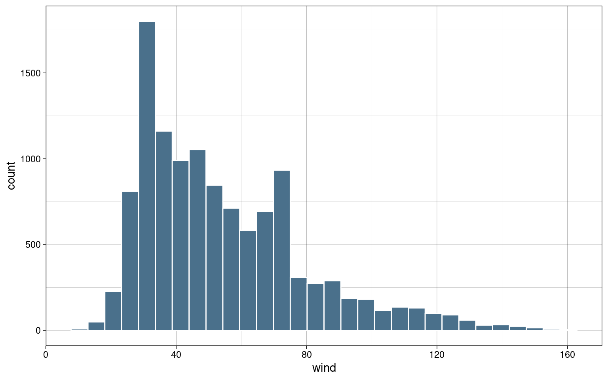
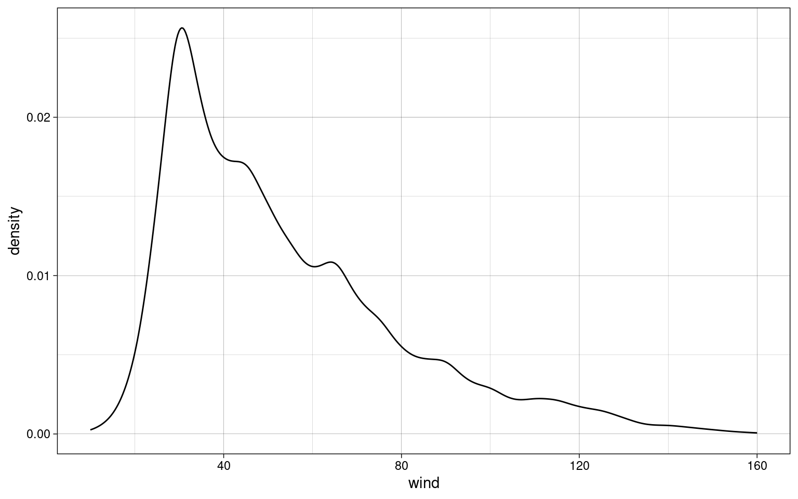

# Einleitung

**TODO**

# Wahrscheinlichkeitstheorie

## Axiome der Wahrscheinlichkeit

### Nicht-Negativät

Eine Wahrscheinlichkeit $Pr$ eines Ereignisses $E$ ist nie negativ.

$$Pr(E) \ge 0$$

### Normalisierung

Die Summe der Wahrscheinlichkeiten $Pr$ aller Ereignisse $E_{i}$ in der
Menge $S$ der möglichen Ereignisse ist 1.

$$E_{i} \in S, Pr(S) = 1$$

$$\sum_{i=1}^{n} Pr(E_{i}) = 1$$

### Additivität

Die Wahrscheinlichkeit $Pr$ von wechselseitig ausschließlichen ($\cup$)
Ereignissen $E_{i}$ entspricht ihrer Summe.

$$Pr(E_{1} \cup E_{2} \cup \dots) = Pr(E_{1}) + Pr(E_{2}) + \dots$$

## Verkettung von Wahrscheinlichkeiten

Wahrscheinlichkeiten von Eriegnissen, die gemeinsam auftreten ($\cap$)
werden multiupliziert, um die Gesamtwahrscheinlichkeit zu ermitteln.

$$Pr(E_{1} \cap E_{2} \cap \dots) = Pr(E_{1}) \cdot Pr(E_{2}) \cdot \dots$$

# Datenmanagement

## Querformat/Langformat

**Daten in Querformat:** mehre Messungen des gleichen Merkmals in
jeweils eigener Spalte

``` r
tibble(
  code = c(1,2,3,4,5),
  measurement.1 = rnorm(n = 5, mean = 100, sd = 10),
  measurement.2 = rnorm(n = 5, mean = 100, sd = 10),
  measurement.3 = rnorm(n = 5, mean = 100, sd = 10)
) -> wide
```

| code | measurement.1 | measurement.2 | measurement.3 |
|-----:|--------------:|--------------:|--------------:|
|    1 |     112.62954 |      84.60050 |     107.63593 |
|    2 |      96.73767 |      90.71433 |      92.00991 |
|    3 |     113.29799 |      97.05280 |      88.52343 |
|    4 |     112.72429 |      99.94233 |      97.10538 |
|    5 |     104.14641 |     124.04653 |      97.00785 |

**Umwandlung in Langformat:** Jede Messung in einer eigenen Zeile

``` r
wide %>%
  pivot_longer(
    cols = starts_with("measurement."),
    names_prefix = "measurement.",
    names_to = "measurement"
  ) -> long
```

| code | measurement |     value |
|-----:|:------------|----------:|
|    1 | 1           | 112.62954 |
|    1 | 2           |  84.60050 |
|    1 | 3           | 107.63593 |
|    2 | 1           |  96.73767 |
|    2 | 2           |  90.71433 |
|    2 | 3           |  92.00991 |
|    3 | 1           | 113.29799 |
|    3 | 2           |  97.05280 |
|    3 | 3           |  88.52343 |
|    4 | 1           | 112.72429 |
|    4 | 2           |  99.94233 |
|    4 | 3           |  97.10538 |
|    5 | 1           | 104.14641 |
|    5 | 2           | 124.04653 |
|    5 | 3           |  97.00785 |

## Winsorisierung

- Werte außerhalb eines gewählten Intervalls werden abgeschnitten und
  durch auf die jeweilige nächste Intervallgrenze gesetzt
- verändert Mittelwert, Varianz und damit auch Standard-Abweichung
- verändert nicht den Median (sofern dieser nicht mit abgeschnitten
  wurde)

``` r
c(0, 1,2,3,4,5,6,7,8,9) %>% ifelse(. > 6, yes = 6, no = .)
```

    ##  [1] 0 1 2 3 4 5 6 6 6 6

# Häufigkeitstabelle

- absolute Häufigkeit
- kumulierte absolute Häufigkeit
- relative Häufigkeit
- kumulierte relative Häufigkeit
- meistens nach einem Merkmal sortiert

Beispiel: Häufigkeiten von Stürmen nach Jahr

``` r
data.short %>%
  group_by(year) %>%
  summarize(absolute = n()) %>%
  ungroup() %>%
  arrange(year) %>%
  mutate(
    absolute.cumulative = cumsum(absolute),
    relative = absolute / sum(absolute),
    relative.cumulative = cumsum(relative)
  ) %>% (knitr::kable)
```

| year | absolute | absolute.cumulative |  relative | relative.cumulative |
|-----:|---------:|--------------------:|----------:|--------------------:|
| 2010 |      402 |                 402 | 0.1323239 |           0.1323239 |
| 2011 |      323 |                 725 | 0.1063199 |           0.2386438 |
| 2012 |      454 |                1179 | 0.1494404 |           0.3880843 |
| 2013 |      202 |                1381 | 0.0664911 |           0.4545754 |
| 2014 |      139 |                1520 | 0.0457538 |           0.5003292 |
| 2015 |      220 |                1740 | 0.0724161 |           0.5727452 |
| 2016 |      396 |                2136 | 0.1303489 |           0.7030941 |
| 2017 |      306 |                2442 | 0.1007242 |           0.8038183 |
| 2018 |      266 |                2708 | 0.0875576 |           0.8913759 |
| 2019 |      330 |                3038 | 0.1086241 |           1.0000000 |

# Split-Apply-Combine

1.  **Split:** Daten nach einem Merkmal gruppieren
2.  **Apply:** Aggregation ausführen (zb Summen, Mittelwerte,
    Minima/Maxima)
3.  **Combine:** Gruppierung aufheben

``` r
data.short %>%
  group_by(name) %>%
  summarize(wind.top = max(wind)) %>%
  ungroup() %>%
  arrange(-wind.top) %>%
  top_n(10) %>%
  (knitr::kable)
```

| name    | wind.top |
|:--------|---------:|
| Dorian  |      160 |
| Maria   |      150 |
| Matthew |      145 |
| Lorenzo |      140 |
| Michael |      140 |
| Igor    |      135 |
| Joaquin |      135 |
| Gonzalo |      125 |
| Julia   |      120 |
| Katia   |      120 |
| Nicole  |      120 |
| Ophelia |      120 |

# Stratifizierung

Daten mit kontinuierlichen Merkmalen oder sehr vielen diskreten
Ausprägungen werden in Strata (Gruppen) zusammengefasst, zB. um dann
aggregierte Werte (Mittelwerte, Min/Max, etc.) in jeder Gruppe zu
berechnen.

Beispiel: höchste Windgeschwindigkeit nach Jahrzehnt

``` r
data.long %>%
  mutate(
    decade = cut(
      year,
      breaks = seq(1970, 2030, 10),
      labels = paste0(seq(1970, 2020, 10), "s"),
      include.lowest = TRUE,
      right = FALSE
    )
  ) %>%
  group_by(decade) %>% summarize(top.wind = max(wind)) %>%
  (knitr::kable)
```

| decade | top.wind |
|:-------|---------:|
| 1970s  |      150 |
| 1980s  |      160 |
| 1990s  |      155 |
| 2000s  |      160 |
| 2010s  |      160 |
| 2020s  |      135 |

# Zentrale Tendenz

## Mittelwert/Durchschnitt

- Summe aller einzelnen Werte, geteilt durch die Anzahl der Werte.
- mindestens intervallskaliert
- anfällig für Extremwerte
- übliches Symbol für Mittelwert einer Population: $\mu$
- übliches Symbol für Mittelwert einer Stichprobe: $\overline{x}$

$$\overline{x} = \frac{1}{n}\cdot\sum_{i=1}^{n} n_{i}$$

``` r
mean(data.long$pressure)
```

    ## [1] 991.9805

## Modus

- Wert mit der größten absoluten Häufigkeit
- alle Skalenniveaus

``` r
data.long %>% group_by(month) %>% summarize(n = n()) %>% arrange(-n) %>% top_n(1)
```

    ## Selecting by n

## Median

- Wert, der wenn alle Werte sortiert sind, in der Mitte steht. Bei
  gerader Anzahl stehen zwei Werte in der Mitte. Dann wird aus diesen
  der Mittelwert gebildet.
- midnestens ordinalskaliert

**Ungerade Anzahl:**

$$1, 2, 2, 4, \color{red}{5}, 5, 7, 8, 9$$

**Gerade Anzahl:**

$$1, 2, 2, 3, \color{red}{3}, \color{red}{5}, 5, 7, 8, 9$$
$$\frac{3+5}{2} = \color{red}{4}$$

``` r
median(data.long$pressure)
```

    ## [1] 999

# Dispersion

## Variationsbreite

- Intervall aus Minimum und Maximum

$$\color{red}{1}, 2, 2, 4, 5, 5, 7, 8, \color{red}{9}$$ $$VB = [1,9]$$

``` r
range(c(1,2,2,4,5,5,7,8,9))
```

    ## [1] 1 9

## Quantile

**Quantil:** Wertebereich, in dem eine bestimmte Menge der
Merkmalsträger liegt, $Q_{p} \to p \%$

**Terzile:** $Q_{33.3}$, $Q_{66.6}$, $Q_{100}$

**Quartile:** $Q_{25}$, $Q_{50}$, $Q_{75}$, $Q_{100}$

**Quintile:** $Q_{20}$, $Q_{40}$, $Q_{60}$, $Q_{80}$, $Q_{100}$

Median entspricht $Q_{50}$, Minimum und Maximum entsprechen $Q_{0}$ bzw.
$Q_{100}$

### Berechnung

Position des Quantils: $Q_{p} \to i = \frac{n}{p}$

Wenn $i$ ganze Zahl ist, dann ist $Q_{p} = \frac{x_{i} + x_{i+1}}{2}$
(Mittelwert aus Position $x_{i}$ und $x_{i + 1}$)

Wenn $i$ keine ganze Zahl ist, dann wird $i$ aufgerundet
($\lceil i\rceil$) und $Q_{p} = x_{\lceil i\rceil}$, der Wert an der
jeweils nächst-höheren Stelle.

``` r
quantile(data.long$pressure, probs = seq(1/5, 5/5, 1/5)) #quintile
```

    ##  20%  40%  60%  80% 100% 
    ##  979  994 1002 1007 1022

### Interquartilsabstand (IQR)

Differenz zwischen erstem und drittem Quartil:

$$IQR = Q_{75} - Q_{25}$$

``` r
IQR(data.long$pressure)
```

    ## [1] 21

## Varianz

- mittlere quadrierte Abweichung vom Mittelwert
- durch Quadierung werden die Abweichungen alle positiv, d.h. Richtung
  der Abweichung spielt für Varianz keine Rolle
- bezieht sich auf Gesamtpopulation (siehe Stichprobenvarianz)
- mindestens intervallskaliert

$$\sigma^2 = \frac{1}{n} \cdot \sum_{i=1}^{n} (x_{i} - \overline{x})^2$$

### Stichprobenvarianz

- bezieht sich auf Stichproben aus einer Population
- enthält eine Korrektur ($n - 1$) gegenüber der allgemeinen Varianz

$$s^2 = \frac{1}{n - 1} \cdot \sum_{i=1}^{n} (x_{i} - \overline{x})^2$$
Je größer $n$, umso mehr nähert sich die Stichprobenvarianz der
allgemeinen Varianz an:

$$\lim_{n \to \infty} \frac{1}{n-1} = \frac{1}{n}$$ R berechnet mit
`var` standardmäßig die Stichproben-Varianz:

``` r
var(data.long$pressure)
```

    ## [1] 382.1348

## Standardabweichung

- positive Quadratwurzel aus der Varianz
- mindestens intervallskaliert
- bezieht sich auf gesamte Population

$$\sigma = \sqrt{\sigma^2}$$

Bei normalverteilten Merkmalen:

- 68.2% zwischen $\overline{x}\pm 1\sigma$
- 95.5% zwischen $\overline{x}\pm 2\sigma$
- 99.5% zwischen $\overline{x}\pm 3\sigma$

### Stichproben-Standardabweichung

- positive Quadratwurzel aus der Stichproben-Varianz
- gleiche Korrektur wie bei Stichproben-Varianz
- bezieht sich auf Stichproben

$$s = \sqrt{s^2}$$

R berechnet mit `sd` standardmäßig die Stichproben-Standardabweichung:

``` r
sd(data.long$pressure)
```

    ## [1] 19.54827

## Variationskoeffizient

- Stichproben-Standardabweichung relativ zum Mittelwert
- verhältnisskaliert

$$CV = \frac{s}{\overline{x}}$$

``` r
sd(data.long$pressure) / mean(data.long$pressure)
```

    ## [1] 0.0197063

## Histogramm

- gibt schnellen visuellen Eindruck der Verteilung empirischer Daten

``` r
data.long %>%
  ggplot(aes(x = wind)) +
  geom_histogram(bins = 30, color = "white", fill = "skyblue4") +
  theme_custom
```



### Kerndichteschätzer

- Schätzung der Wahrscheinlihckeitsdichte einer empirischen Verteilung

``` r
data.long %>%
  ggplot(aes(x = wind)) +
  geom_density() +
  theme_custom
```



# Standardisierung

Durch Standardisierung werden Werte miteinander vergleichbar, auch wenn
sie z.B. in unterschiedlichen Größenordnungen oder Einheiten vorliegen.

## Z-Werte / Z-Standardisierung

- spielen in vielen weiteren Berechnungen eine sehr große Rolle

Alle einzelnen Werte werden auf 0 zentriert und so skaliert, dass sie
eine Standardabweichung von 1 haben:

$$z_{i} = \frac{x_{i} - \overline{x}}{s}$$

``` r
data.short %>% select(wind) %>%
  mutate(wind.z = (wind - mean(wind))/sd(wind))
```

## Prozentränge

- geben an, wieviel Prozent einer Häufigkeitsverteilung den gleichen
  oder einen niedrigeren Wert in einem Merkmal haben
- mindestens intervallskaliert
- basiert auf Z-Werten

``` r
data.short %>% select(wind) %>%
  mutate(
    wind.z = (wind - mean(wind))/sd(wind),
    wind.pr = pnorm(wind.z)
  )
```

## Rang-basierte Normalisierung

- reduziert Skalenniveau zu ordinal
- erzeugt normalverteilte Werte
- sehr effektiv gegen Extremwerte, ohne sie komplett zu entfernen

**Schritt 1: Werte sortieren**

**Schritt 2: Ränge zuordnen**

Bei gleichen Werten wird ein Rang mehrfach vergeben

**Schritt 3: bei geteilten Rängen Mittelwert bilden**

**Schritt 4: Prozentränge und Z-Werte berechnen**

$$y = \frac{r-0.5}{n}$$

Nach der Rang-basierten Normalisierung sind $p$ und $z$ normalverteilt.

# Korrelation

**TODO**

# Modellbildung

**TODO**
