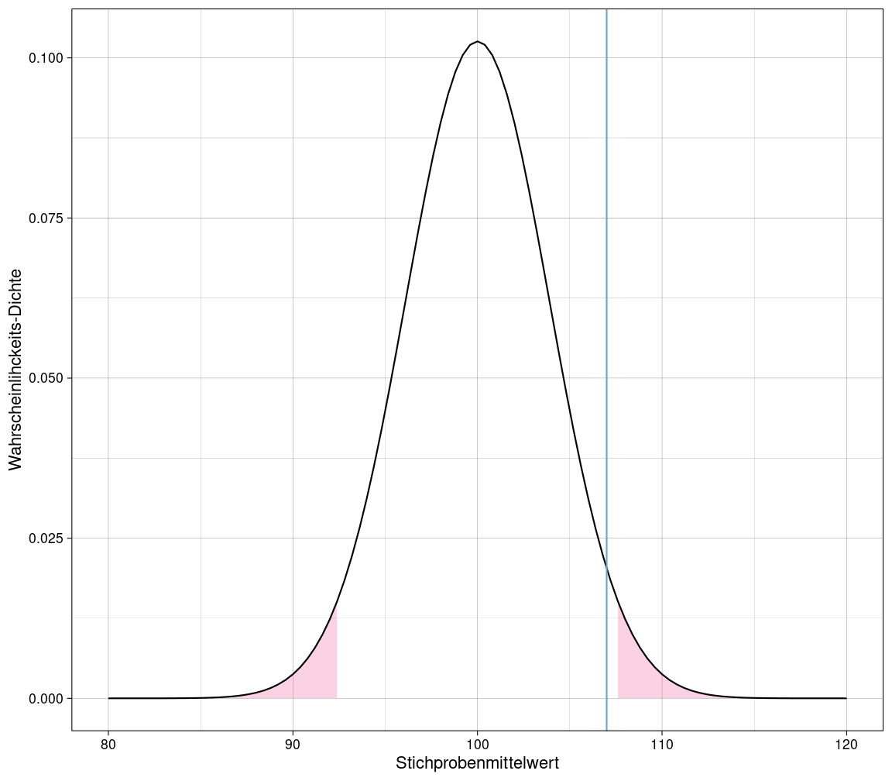

<!--

AFTER EDITING THIS FILE:

1. open publish.Rmd and run it
2. then commit the changes to version control

-->


# Stichprobenkennwerte-Verteilung

## Beispiel: Mittelwert

$$\overline{x} = \frac{1}{k} \sum_{i=1}^{k}\overline{x}_i$$

- $k$: Anzahl gezogener Stichproben
- $\overline{x}_{i}$: Mittelwerte innerhalb der Stichproben
- $\overline{x}$: durchschnittlicher Mittelwerte der Stichproben

Erwartungswert des durchschnittlichen Mittelwertes der Stichproben ist der Mittelwert der Population:

$$E(\overline{x}) = \mu$$

## Standardfehler des Mittelwertes

Die Standardabweichung der Stichprobenkennwert-Verteilung wird *Standardfehler* genannt, z.B. Standardfehler des Mittelwertes: $\sigma_{\overline{x}}$


## Berechnung des Standardfehlers des Mittelwertes

- wird anhand der Standardabweichung der Population $\sigma$ berechnet

Bei $n < 5\%$ der Populationsgröße N:

$$\sigma_{\overline{x}} = \frac{\sigma}{\sqrt{n}}$$

Bei $n \ge 5\%$ der Populationsgröße N wird die "Finite Population"-Korrektur eingeführt:

$$\sigma_{\overline{x}} = \frac{\sigma}{\sqrt{n}} \cdot \color{red}{\sqrt{\frac{N-n}{N-1}}}$$

Je größer die einzelnen Stichprobengrößen, umso geringer wird der Standardfehler:


## Schätzung des Standardfehlers des Mittelwertes

Wenn die Varianz der Population $\sigma^2$ nicht bekannt ist, wird er geschätzte Standardfehler $\hat{\sigma}_{\overline{x}}$ aus der empirischen Varianz $s^{2*}$ bestimmt:

$$\hat{\sigma}_{\overline{x}} = \sqrt{\frac{\hat\sigma^2_x}{n}} = \sqrt{\frac{s^{2*}_x}{n - 1}}$$
Wichtig: die empirische Varianz $s^{2*}$ ist **nicht** gleich der Stichprobenvarianz $s^2$, siehe [Punktschätzung der Varianz](#punktschätzung-der-varianz). Die Stichprobenvarianz $s^2$ enthält bereits die Bessel-Korrektur $n-1$ und muss entsprechend nicht nochmals in der Berechnung des geschätzten Standardfehlers korrigiert werden:

$$\hat{\sigma}_{\overline{x}} = \sqrt{\frac{s^2_x}{n}}$$

Die Stichprobenkennwerte-Verteilung folgt dann **nicht mehr** der Normalverteilung sondern nach Standardisierung einer Student-t-Verteilung mit $n - 1$ Freiheitsgraden:

$$\frac{\overline{x} - \mu}{\hat{\sigma}_{\overline{x}}} \sim Student(df = n -1)$$


- $Normal(\mu = 0, \sigma = 1)$ (blaue Kurve): Verteilung in der Population
- $Student(df = n-1)$ (grüne Kurve): geschätzte Populationsverteilung

Mit steigendem $n$ nähern sich die beiden Verteilungen immer weiter an.

## Zentraler Grenzwertsatz

Die Stichprobenkennwerteverteilung der Mittelwerte nähert sich mit zunehmender Stichprobengröße der Normalverteilung an, unabhängig davon, wie das Merkmal in der Population verteilt ist.

1 Sample ($n = 1000$) mit uniformer Verteilung:


Mittelwerteverteilung von $k = 500$ Samples mit je $n = 1000$:


Verteilung nähert sich sichtbar der Normalverteilung an.

# Punktschätzung von Populationsparametern

Populationsparameter sind meist unbekannt, daher werden sie auf Basis der Statistiken (Verteilungskennwerte) einer einzelnen Stichprobe geschätzt. ("Punktschätzung", weil ein Punktwert und kein Intervall geschätzt wird)

**Populationsparameter**: Kennwert einer theoretisch unendlich großen Population

**Stichprobenstatistik**: Kennwert einer Verteilung tatsächlicher, empirischer Stichproben

**Schätzer**: Inferenz von der Stichprobe auf die Population

|                         | Population   | Stichprobenstatistik | Schätzer           |
|-------------------------|-------------:|---------------------:|-------------------:|
| Arithmetisches Mittel   | $\mu$        | $\overline{x}$       | $\hat{\mu}$        |
| Standardabweichung (SD) | $\sigma$     | $s$                  | $\hat{\sigma}$     |
| Varianz                 | $\sigma^{2}$ | $s^{2}$              | $\hat{\sigma}^{2}$ |
| Korrelation             | $\rho$       | $r$                  | $\hat{\rho}$       |
| Regressionsgewicht      | $\beta$      | $b$                  | $\hat{\beta}$      |

## Gütekriterien für Parameterschätzung

1. **Erwartungstreue**

    Erwartungswert des Stichprobenkennwertes entspricht dem Populationsparameter

1. **Konsistenz**

    Stichprobenkennwert nähert sich mit wachsender Stichprobe dem Populationsparameter
    
1. **Effizienz**

    Stichprobenkennwert hat den geringsten Standardfehler unter allen erwartungstreuen Schätzern für einen Populationsparameter
    
1. **Suffizienz**

    Stichprobenkennwert basiert auf alles in den Daten enthaltenen Informationen

## Punktschätzung des Mittelwertes

$k = 100$ Stichproben einer uniform verteilten Merkmals $x$ mit jeweils $n = 100$ Messungen.


Der Mittelwert der Stichprobenverteilung $\hat{\mu}$ (rote Linie) nähert sich mit steigender Stichprobenzahl ($i$) dem Populationsmittelwert $\mu$ (blaue Linie) immer weiter an.

Der Mittelwert der Stichprobenverteilung $\hat{\mu}$ ist also ein erwartungstreuer und konsistenter Schätzer des Populationsmittelwertes $\mu$.

## Punktschätzung der Varianz

| empirische Varianz | Stichprobenvarianz |
|:-:|:-:|
| $s^{2*} = \frac{1}{n} \sum_{i = 1}^{n}(x_i - \overline{x})^2$ | $s^2 = \frac{1}{n - 1} \sum_{i = 1}^{n}(x_i - \overline{x})^2$ |

$k = 100$ Stichproben mit je $n = 100$ Messungen eines normalverteilten Merkmals:


Die empirische Varianz $s^{2*}$ (rote Linie) weicht stärker vom wahren Kennwert der Population $\sigma^{2}$ (blaue Linie) ab als die Stichproben-Varianz $s^2$ (grüne Linie).

Die empirische Varianz ist kein erwartungstreuer Schätzer der Populationsvarianz, die Stichproben-Varianz dagegen schon.

**Aber:** $\sqrt{s^2}$ (Stichproben-Standardabweichung $s$) ist **KEIN** erwartungstreuer Schätzer der Populations-Standardabweichung $\sigma$!

# Intervallschätzung von Populationsparametern

**Konfidenzintervall**: Intervall um den geschätzten Parameter, in dem mit Wahrscheinlichkeit $1-\alpha$ der wahre Populationsparameter liegt.

## Konfidenzintervall des Mittelwertes

Nach dem [zentralem Grenzwertsatz](#zentraler-grenzwertsatz) folgen die Mittelwerte der Stichproben $\overline{x}$ einer Normalverteilung mit den Parametern Populationsmittelwert $\mu$ und Standardfehler der Stichprobenmittelwerte $\sigma_{\overline{x}}$:

$$\overline{x} \sim Normal(\mu, \sigma_{\overline{x}})$$

Entsprechend folgen die z-standardisierten Mittelwerte der Stichproben der Standard-Normalverteilung:

$$\frac{\overline{x} - \mu}{\sigma_{\overline{x}}} \sim Normal(0,1)$$

Die Fläche $1 - \alpha = 0.95$ liegt im Intervall $z = [-1.96, 1.96]$ der Standard-Normalverteilung.

$1-\alpha$ wird auch Konfidenzkoeffizient genannt.

Beispiel: Stichprobe mit $n = 100$ Messungen eines normalverteilten Merkmals:


Der Populationsparameter $\mu$ liegt im Intervall um den Stichprobenmittelwert $\overline{x}$ (grüne Linie), das 95% der Fläche der Kennwertverteilung (pink) abdeckt.

Da es ein zweiseitiges Konfidenzintervall ist, wird an beidem Seiten der Verteilung 2.5% abgeschnitten damit insgesamt $\alpha = 5\%$ gilt.

### Konfidenzintervall pro Stichprobe

$k = 100$ Stichproben zu je $n = 1000$ normalverteilten Messungen, mit zweiseitigem Konfidenzintervall $\alpha = 0.05$:


Prozentsatz der Mittelwerte die mit ihrem Konfidenzintervall **nicht** den Populationsmittelwert abdecken, entspricht in etwa dem Fehlerniveau $\alpha = 5\%$. 4 Stichproben von $k = 100$ decken nicht den Populationsmittelwert in ihrem Konfidenzintervall ab.


```r
samples %>%
  filter(
    x.mean.lower > mu | x.mean.upper < mu
  ) %>% summarize(p = n() / k)
```


## Schätzung des Konfidenzintervalls des Mittelwertes

Wenn die Standardabweichung $\sigma$ der Population nicht bekannt ist, der Standardfehler also nicht daraus abgeleitet werden kann, wird das Konfidenzintervall anhand des [geschätzten Standardfehlers](#sch%C3%A4tzung-des-standardfehlers-des-mittelwertes) berechnet.

$$\overline{x} \pm t(1- \frac{\alpha}{2}, n - 1) \cdot \hat\sigma_{\overline{x}}$$

Stichprobe von $n = 10$ Messungen eines normalverteilten Merkmals:


*Es ist gleichgültig ob das Konfidenzintervall um den Populationsmittelwert oder den Stichprobenmittelwert gelegt wird. Wichtig ist, dass beide Werte im Intervall liegen. Bei t-Verteilungen ist es einfacher, das Intervall um den 0-Punkt zu legen und alle Werte entsprechend zu standardisieren.*

## Konfidenzintervall abgängig von Stichprobengröße

Sowohl der Standardfehler $\sigma_{\overline{x}}$ als auch der geschätzte Standardfehler $\hat{\sigma}_{\overline{x}}$ hängen von der Stichprobengröße ab und werden kleiner, je größer die Stichprobe ist. Entsprechend verändert sich auch das Konfidenzintervall.

Zwei Stichproben mit $n_1 = 20$ (grau) und $n_2 = 40$ (pink) Messungen des gleichen normalverteilten Merkmals, sowie Populationsmittelwert (blau):


Die größere Stichprobe $n_2 = 40$ hat ein deutlich schmaleres Konfidenzintervall.

# Statistische Hypothesenprüfung

## Signifikanztests

**Nullhypothese $H_0$:** Annahme, dass kein Unterschied zwischen zwei Parametern besteht.

**p-Wert:** Wahrscheinlichkeit, dass ein beobachteter Effekt trotz Annahme der $H_0$ zufällig auftritt.

- Bedingte Wahrscheinlichkeit $Pr(\overline{x} | H_0)$, also eine Aussage über die Wahrscheinlichkeit des beobachteten Stichprobenmittelwertes $Pr(\overline{x})$ unter der Voraussetzung dass die Nullhypothese $H_0$ wahr ist, **NICHT** über die Wahrscheinlichkeit, dass die Nullhypothese $H_0$ an sich zutrifft.

**"Signifikant"** ist ein Effekt, wenn der **p-Wert** unter einem zuvor festgelegten Signifikanz-Niveau $\alpha$ liegt, oft 5%.

### Einseitiger Signifikanztest

Population mit $\mu = 100$ und $\sigma = 55$, Stichprobe mit $n = 200$.

Liegt eine Stichprobe mit $\overline{x} = 107$ (blaue Linie) in den oberen 5% der Wahrscheinlichkeitsmasse? D.h. ist die Wahrscheinlichkeit für solch eine Stichprobe unter dem Signifikanz-Niveau?


**Die Parameter der Dichtefunktion sind hier Populationsmittelwert und Standardfehler $\sigma_{\overline{x}}$, errechnet aus der Standardabweichung $\sigma$ der Population und der Stichprobengröße $n$. (siehe [Berechnung des Standardfehlers](#berechnung-des-standardfehlers-des-mittelwertes))**

### Zweiseitiger Signifikanztest

Population mit $\mu = 100$ und $\sigma = 55$, Stichprobe mit $n = 200$.

Beim zweiseitigen Signifikanztest wird das Signifikanz-Niveau auf beide Seiten aufgeteilt, da es die Wahrscheinlichkeit betrifft mit der eine Stichprobe in einem der beiden Extrembereiche liegt, egal in welchem.

Liegt eine Stichprobe mit $\overline{x} = 107$ (blaue Linie) außerhalb der zentralen 95% der Wahrscheinlichkeitsmasse?



### Standardisierte Prüfgrößen

Oft werden Daten zur Hypothesenprüfung standardisiert:

$$z_{\overline{x}} = \frac{\overline{x} - \mu}{\sigma_{\overline{x}}}$$
Die Verteilung der Stichprobenkennwerte in der Population ist dann auf $\mu = 0$ zentriert und hat einen Standardfehler $\sigma_{\overline{x}} = 1.0$.


### Signifikanztest mit empirischen Daten

**One-Sample-T-Test:** gibt für gegebene Samples und Populationsmittelwert den p-Wert aus. Verglichen wird eine Stichprobe (daher "one sample") mit der Gesamtpopulation.

Da die Standardabweichung der Population nicht bekannt ist, wird der Standardfehler mittels der T-Verteilung geschätzt. (siehe [Schätzung des Standardfehlers](#sch%C3%A4tzung-des-standardfehlers-des-mittelwertes))

Samples:


Einseitiger One-Sample-T-Test:


```r
mu <- 100
alpha <- 0.05

# alternative = "greater" -  > Einseitiger Test in positiver Richtung
# alternative = "less"      -> Einseitiger Test in negativer Richtung
# alternative = "two.sided" -> Zweiseitiger Test
t.test(samples, mu = mu, alternative = "greater", conf.level = 1 - alpha)
```

```
## 
## 	One Sample t-test
## 
## data:  samples
## t = 1.204, df = 9, p-value = 0.1296
## alternative hypothesis: true mean is greater than 100
## 95 percent confidence interval:
##  88.01066      Inf
## sample estimates:
## mean of x 
##  122.9462
```


## Hypothesentests

**Nullhypothese $H_0$:** Annahme, dass ein bestimmter bedeutsamer Effekt nicht existiert.

**Alternativhypothese $H_1$:** Annahme, dass ein bestimmter bedeutsamer Effekt existiert

**Die Nullhypothese ist niemals wirklich wahr. Mit ausreichender Stichprobengröße lässt sich ein beliebig kleiner Effekt zeigen.**

**Irrtumswahrscheinlichkeit $\alpha$:** Wahrscheinlichkeit, dass ein Test in einer Stichprobe einen bedeutsamen Effekt zufällig anzeigt, der eigentlich in der Population nicht existiert, also dass die Nullhypothese $H_0$ fälschlicherweise abgelehnt wird. ($\alpha$-Fehler, False-Positive)

**Irrtumswahrscheinlichkeit $\beta$:** Wahrscheinlichkeit, dass ein Effekt, der in der Population vorhanden ist, zufällig in der getesteten Stichprobe nicht auftaucht, also dass die Nullhypothese $H_0$ fälschlicherweise angenommen wird. ($\beta$-Fehler, False-Negative)

**Teststärke/Power:** $1 - \beta$, je höher die Power, umso unwahrscheinlicher werden $\beta$-Fehler

**parametrische vs. nicht-parametrische Tests:** parametrische Tests setzen voraus, dass Merkmale in der Population normalverteilt sind (z.B. Gauss-Test, T-Test). Nicht-parametrische Tests machen diese Annahme nicht (Gegenstand im M.Sc.-Studium).

Ein Test kann zwar einen p-Wert unter $\alpha$-Niveau (0.05) liefern, aber trotzdem einen sehr großer $\beta$-Fehler haben:

- grüne Linie: $\mu$
- blaue Linie: $\overline{x}$
- rosa Fläche: $\alpha$
- blaue Fläche: $\beta$
- gestrichelte Linie: kritischer Wert


Mit niedrigerem $\alpha$-Niveau (0.01) wird der $\beta$-Fehler sogar noch größer.


Um den $\beta$-Fehler zu reduzieren, müsste ein stärkerer Effekt ($\overline{x} - \mu$) vorhanden sein:


### Standardisierter Effekt: Cohen's $\delta$

*(Manchmal auch: "Cohen's d")*

$$\delta = \frac{\overline{x} - \mu}{\sigma}$$

- $\overline{x}$: Stichproben-Mittelwert
- $\mu$: Populationsmittelwert
- $\sigma$: Standardabweichung der Population


### Konfidenzintervalle für Cohen's $\delta$

Die Stichprobenkennwerte-Verteilung von $\overline{x}$ ist normalverteilt (siehe [Zentraler Grenzwertsatz](#zentraler-grenzwertsatz))

Der Erwartungswert von $\delta$ entspricht der standardisierten Differenz zwischen Stichprobenmittelwert und Populationsmittelwert.

$$E_{\delta} = \frac{\overline{x} - \mu}{\sigma}$$

Die Streuung $\sigma_{\delta}$ ist der Standardfehler wobei dieser hier vereinfacht $\frac{1}{\sqrt{n}}$ ist weil Standardisierung bereits erfolgt ist (die Standardabweichung von standardisierten Größen ist 1):

$$\sigma_{\delta} = \sigma_{\overline{x}} = \frac{1}{\sqrt{n}}$$

$$\delta \sim  Normal(E_{\delta} = \frac{\overline{x} - \mu}{\sigma}, \sigma_{\delta} = \frac{1}{\sqrt{n}})$$

Damit lassen sich die Konfidenzintervalle für ein gegebenes $\alpha$-Niveau berechnen:

$$\delta \pm z(1-\frac{\alpha}{2}) \cdot \sigma_{\delta} = \frac{\overline{x} - \mu}{\sigma} \pm  z(1-\frac{\alpha}{2}) \cdot \frac{1}{\sqrt{n}}$$


Konventionen für Effektinterpretationen für $\delta$ nach Cohen:

- $|d|  \approx 0.14$: "kleiner" Effekt
- $|d|  \approx 0.35$: "mittlerer" Effekt
- $|d|  \approx 0.57$: "großer" Effekt

**TODO: ci.smd in R (MBESS)**

### Einstichproben-Gauss-Test

Voraussetzungen:

- Merkmal ist in der Population normalverteilt
  - alternativ: bei nicht-normalverteiltem Merkmal $x$ ist der Stichproben Mittelwert ab ca. $n = 30$ nahezu normalverteilt. (Siehe [zentraler Grenzwertsatz](#zentraler-grenzwertsatz))
  
    Der z-Test ist dann allerdings nicht mehr exakt.
- Standardabweichung $\sigma$ in der Population ist bekannt

Gauss-Test, auch "z-Test" genannt, ist geeignet, wenn die Standardabweichung $\sigma$ der Population bekannt ist, und damit der Standardfehler $\sigma_{\overline{x}}$ berechnet werden kann. (Siehe [Berechnung des Standardfehlers des Mittelwertes](#berechnung-des-standardfehlers-des-mittelwertes))

Prüfgröße: $z_{\overline{x} - \mu}$, z-standardisierte Differenz von Stichprobenmittelwert und Populationsmittelwert

$$z_{\overline{x} - \mu} = \frac{\overline{x} - \mu}{\sigma_{\overline{x}}}$$

Kritischer Wert: Wert für $\overline{x}$ der über- bzw. unterschritten werden muss damit $p \le 0.05$ eingehalten wird.

$Q(p)$ ist hier die Quantilsfunktion der Normalverteilung, die bestimmt welcher Wert eine Wahrscheinlichkeit von $p$ oder weniger hat.

Die Nullhypothese $H_0$ wird abgelehnt wenn:

- bei einseitigem Test in positiver Richtung
  
  $z_{\overline{x} - \mu} \ge Q(1 - \alpha)$
- bei einseitigem Test in negativer Richtung
  
  $z_{\overline{x} - \mu} \le Q(\alpha)$
- bei zweiseitigem Test
  
  $z_{\overline{x} - \mu} \le Q(\frac{\alpha}{2}) \cup z_{\overline{x} - \mu} \ge Q(1 - \frac{\alpha}{2})$
  
  ($\cup$: "oder")
  
Siehe auch: [Signifikanztests](#signifikanztests)

#### Einstichproben-Gauss-Test in R


Samples mit $\mu = 0.5$, $\sigma = 1.0$, und $n = 20$


```
##  [1]  1.76295428  0.17376664  1.82979926  1.77242932  0.91464143 -1.03995004 -0.42856703  0.20527955  0.49423283  2.90465339  1.26359346 -0.29900925 -0.64765701  0.21053843
## [15]  0.20078488  0.08848917  0.75222345 -0.39192113  0.93568330 -0.73753842
```


```r
library(BSDA)

z.test(samples, mu = 0, sigma.x = 1, conf.level = 0.95, alternative = "greater")
```

```
## 
## 	One-sample z-Test
## 
## data:  samples
## z = 2.2281, p-value = 0.01294
## alternative hypothesis: true mean is greater than 0
## 95 percent confidence interval:
##  0.1304209        NA
## sample estimates:
## mean of x 
## 0.4982213
```

### Einstichproben T-Test

Voraussetzungen:

- Merkmal ist in der Population normalverteilt
  - alternativ: bei nicht-normalverteiltem Merkmal $x$ ist der Stichproben Mittelwert ab ca. $n = 30$ nahezu normalverteilt. (Siehe [zentraler Grenzwertsatz](#zentraler-grenzwertsatz))
- Stichprobengröße ist bekannt (zur Schätzung des Standardfehlers)

*Der T-Test ist wenn möglich dem Gauss-Test vorzuziehen, da er auch ohne bekannte Standardabweichung der Population exakter ist.*

Schätzung des Standardfehlers $\hat{\sigma}_{\overline{x}}$

- $\hat{\sigma}^2_{x}$: geschätzte Populations-Varianz
- $s^2_{x}$: Stichproben-Varianz
- $s^{2*}$: empirische Varianz

$$\hat{\sigma}_{\overline{x}} = \sqrt{\frac{\hat{\sigma}^2_{x}}{n}} = \sqrt{\frac{s^2_{x}}{n}} = \sqrt{\frac{s^{2*}_{x}}{n-1}}$$

Prüfgröße: $t_{\overline{x} - \mu}$

$$t_{\overline{x} - \mu} = \frac{\overline{x} - \mu}{\hat{\sigma}_{\overline{x}}}$$

Kritischer Wert: Analog zum [Einstichproben Gauss-Test](#einstichproben-gauss-test)

$Q(p)$ ist beim t-Test die Quantilsfunktion der Student-T-Verteilung mit $n-1$ Freiheitsgraden, denn die Verteilung von $t_{\overline{x} - \mu}$ folgt dieser Student-T-Verteilung:

$$t_{\overline{x} - \mu} \sim Student(df = n -1 )$$

Beispiel: Zwei T-Tests mit entsprechenden Student-T-Verteilungen für $n=10$ und $n=100$.

Die Prüfgröße fällt bei $n=10$ nicht über den kritischen Wert für $p \le \alpha$, bei $n=100$ aber schon, da der geschätzte Standardfehler geringer wird, d.h. der Test wird genauer.


#### Einstichproben T-Test in R


Samples mit $\mu = 0.5$, $\sigma = 1.0$, und $n = 20$


```
##  [1] 0.8525909 0.5347533 0.8659599 0.8544859 0.6829283 0.2920100 0.4142866 0.5410559 0.5988466 1.0809307 0.7527187 0.4401982 0.3704686 0.5421077 0.5401570 0.5176978 0.6504447
## [18] 0.4216158 0.6871367 0.3524923
```


```r
t.test(samples, alternative = "greater", mu = 0.5, conf.level = 0.95)
```

```
## 
## 	One Sample t-test
## 
## data:  samples
## t = 2.1812, df = 19, p-value = 0.02097
## alternative hypothesis: true mean is greater than 0.5
## 95 percent confidence interval:
##  0.5206532       Inf
## sample estimates:
## mean of x 
## 0.5996443
```

### Einstichproben T-Test für abhängige Beobachtungen

T-Test für abhängige Messungen in einer Stichprobe. z.B. wenn die gleiche Stichprobe von Versuchspersonen vor und nach einem Treatment die gleiche Messung durchläuft.

Stichprobengröße ist hier die Anzahl der Messwertpaare, nicht die Anzahl aller Messungen.

Es wird eine neue Variable $\overline{x}_D$ eingeführt, der Mittelwert der Differenz der beiden Messungen von jeweils der gleichen Versuchsperson.

- $H_0$: $\overline{x}_D = 0$
- $H_1$: $\overline{x}_D \neq 0$ (zweiseitiger Test)

*Es ist egal ob zuerst die Differenzen der Messungen für jede Versuchsperson gebildet und dann gemittelt werden, oder ob die Differenz der Mittelwerte beider Messungen gebildet wird. Das Ergebnis ist das gleiche*

Der Rest der Tests verläuft wie beim Einstichproben T-Test.

#### Einstichproben T-Test für abhängige Beobachtungen T-Test in R


$n=20$ Samples,


```r
samples
```


```r
xd = samples$m2 - samples$m1
t.test(xd, mu = 0, alternative = "two.sided", conf.level = 0.95)
```

```
## 
## 	One Sample t-test
## 
## data:  xd
## t = -2.853, df = 9, p-value = 0.019
## alternative hypothesis: true mean is not equal to 0
## 95 percent confidence interval:
##  -2.1962337 -0.2536916
## sample estimates:
## mean of x 
## -1.224963
```

Alternativ kann die Funktion `t.test` auch die paarweisen Differenzen automatisch bestimmen:


```r
t.test(x = samples$m2, y = samples$m1,
       paired = TRUE,
       mu = 0,
       alternative = "two.sided",
       conf.level = 0.95)
```

```
## 
## 	Paired t-test
## 
## data:  samples$m2 and samples$m1
## t = -2.853, df = 9, p-value = 0.019
## alternative hypothesis: true mean difference is not equal to 0
## 95 percent confidence interval:
##  -2.1962337 -0.2536916
## sample estimates:
## mean difference 
##       -1.224963
```

### Einstichproben Binomialtest

Test für ein dichotomes Merkmal $x$ (Merkmal mit zwei möglichen Ausprägungen): $x \in \{0,1\}$

$\pi_0$: Wahrscheinlichkeit in der Population für $x = 1$

$\pi$: Wahrscheinlichkeit in der Stichprobe für $x = 1$

Hypothesenpaare:

- ungerichtet
  - $H_0$: $\pi_0 = \pi$
  - $H_1$: $\pi_0 \ne \pi$
- gerichtet, positiv
  - $H_0$: $\pi_0 \ge \pi$
  - $H_1$: $\pi_0 \lt \pi$
- gerichtet, negativ
  - $H_0$: $\pi_0 \le \pi$
  - $H_1$: $\pi_0 \gt \pi$
  
Aus $\pi_0$ und $\pi$ ergeben sich zwei Binomialverteilungen über $n$ Ziehungen, mit $\alpha$-Fehler analog zu anderen Tests.


#### Binomialtest in R


```r
binom.test(39, 60, p = 0.5, conf.level = 0.95, alternative = "greater")
```

```
## 
## 	Exact binomial test
## 
## data:  39 and 60
## number of successes = 39, number of trials = 60, p-value = 0.01367
## alternative hypothesis: true probability of success is greater than 0.5
## 95 percent confidence interval:
##  0.5363726 1.0000000
## sample estimates:
## probability of success 
##                   0.65
```

### Zweistichproben T-Test

Wird angewendet beim Vergleich von 2 unabhängigen Stichproben (z.B. Studienarme).

Voraussetzungen:

- normalverteiltes Merkmal
- Messwerte in beiden Stichproben unabhängig
- Varianzhomogenität zwischen den Stichproben

Prüfgröße:

$$T = t_{\overline{x}_1} - t_{\overline{x}_2} = \frac{\overline{x}_1 - \overline{x}_2} {\hat{\sigma}_{\overline{x}_1 - \overline{x}_2}}$$

$T$ folgt der Student-T-Verteilung mit $df = n_1 + n_2 - 2$$ Freiheitsgraden

$$T \sim Student(0, 1, n_1 + n_2 - 2)$$

Standardfehler hängt hier von den Größen beider Stichproben ab, da diese nicht unbedingt gleich groß sind.

$$\hat{\sigma}_{\overline{x}_1 - \overline{x}_2} = \sqrt{\frac{\hat{\sigma}^2_{inn}} {n_1} + \frac{\hat{\sigma}^2_{inn}}{n_2}}$$

Geteilte/Gepoolte Innerhalb-Varianz $\hat{\sigma}^2_{inn}$ wird aus den geschätzten Varianzen der Stichproben ($\hat{\sigma}^2_1$, $\hat{\sigma}^2_2$) berechnet (siehe auch [Punktschätzung der Varianz](#punktschätzung-der-varianz)):

$$\hat{\sigma}^2_{inn} = \frac{\hat{\sigma}^2_1 \cdot (n_1 -1) + \hat{\sigma}^2_2 \cdot (n_2 -1)} {(n_1 - 1) + (n_2 - 1)}$$

Beispiel: Stichproben aus zwei Studienarmen mit jeweils $n = 100$


Verteilung der Prüfgröße $T$:


#### Zweistichproben T-Test in R


```r
t.test(samples2$x, y = samples1$x, alternative = "greater", conf.level = 0.95)
```

```
## 
## 	Welch Two Sample t-test
## 
## data:  samples2$x and samples1$x
## t = 2.5715, df = 193.31, p-value = 0.005438
## alternative hypothesis: true difference in means is greater than 0
## 95 percent confidence interval:
##  6.070815      Inf
## sample estimates:
## mean of x mean of y 
##  118.1253  101.1334
```

## Power und Stichprobenplanung

**Power: $1-\beta$**

$\beta$ und Power hängen vom Standardfehler und damit von der Stichprobengröße ab.

Beispiel $n = 20$, $\beta$-Fehler ist gering:


Bei $n = 7$ ist der $\beta$-Fehler deutlich höher und die Power daher geringer, während $\alpha$-Niveau weiterhin unterschritten wird:


$\beta$ ist ebenfalls vom Effekt abhängig. Zur Planung der Stichprobengröße müssen $\alpha$-Niveau und der minimale als signifikant akzeptierte Effekt bekannt sein.

### Stichprobenplanung in R


```r
library(pwr)

# post-hoc Power-Analyse für einseitigen Gauss-Test/Z-Test
# - Stichproben-Signifikanztest
# - Normalverteilte Merkmale
# - bekannter Standardabweichung
pwr.norm.test(0.5, n = 10, sig.level = 0.05, alternative = "greater")
```

```
## 
##      Mean power calculation for normal distribution with known variance 
## 
##               d = 0.5
##               n = 10
##       sig.level = 0.05
##           power = 0.4745987
##     alternative = greater
```

```r
# bei Test in negativer Richtung: alternative = "lesser"
# bei zweiseitigem Test: alternative = "two.sided"
```


```r
# a priori Power Analyse für Zweistichproben-T-Test
# n ist noch nicht bekannt, aber alpha-Niveau, Effekt und Power sind gegeben
pwr.t.test(d = 0.5, sig.level = 0.05, power = 0.9, type = "two.sample")
```

```
## 
##      Two-sample t test power calculation 
## 
##               n = 85.03128
##               d = 0.5
##       sig.level = 0.05
##           power = 0.9
##     alternative = two.sided
## 
## NOTE: n is number in *each* group
```

Plot von Power in Abhängigkeit von Stichprobengröße:

Effekt $d = 0.7$, $\alpha_1 = 5\%$ (blau), $\alpha_2 = 1\%$ (pink)


```r
# Funktion die einen einseitigen Z-Test ausführt
# und den Power-Wert aus dem Ergebnis extrahiert
power <- function(n, d = 1, alpha = 0.05) {
  test <- pwr.norm.test(d, n = n, sig.level = alpha, alternative = "greater")
  
  return(test[[4]])
}

# Plot der Funktion über Stichprobengrößen 1-75
# Effekt d = 0.7
# alpha = 0.05 und alpha = 0.01
tibble(
  n = 1:50,
  power5 = power(n, d = 0.7, alpha = 0.05),
  power1 = power(n, d = 0.7, alpha = 0.01),
  ) %>% ggplot(aes(x = n, y = power)) +
  geom_col(aes(y = power5), fill = "skyblue3") +
  geom_col(aes(y = power1), fill = "hotpink3") +
  annotate("text", label = "alpha[1] == 0.05", parse = TRUE, x = 2, y = 0.95, color = "skyblue3") +
  annotate("text", label = "alpha[2] == 0.01", parse = TRUE, x = 2, y = 0.90, color = "hotpink3") +
  xlab("Stichprobengröße") +
  ylab("Power") +
  theme_custom
```


Für ein strengeres $\alpha_2 = 1\%$ ist gegenüber $\alpha_1 = 5\%$ eine größere Stichrobe nötig, um die gleiche Power zu erreichen.

## Tests für Kategoriale Merkmale

Kategoriale Merkmale:

- nominalskalierte Merkmale
- ordinalskalierte Merkmale
  - auch geschichtete metrische Merkmale
  
### $\chi^2$-Statistik

$$\chi^2 = \sum_{i=1}^r{\sum_{j=1}^c{\frac{(f_{ij} - e_{ij})^2}{e_{ij}}}}$$

- $r$: Anzahl Zeilen
- $c$: Anzahl Spalten
- $f_{ij}$: beobachtete Häufigkeiten
- $e_{ij}$: erwartete Häufigkeiten
  
  $e_{ij} = \frac{Zeilensumme \cdot Spaltensumme}{Stichprobenumfang}$
  
### Cramer's $V$

$$V = \sqrt{\frac{\chi^2}{n \cdot (m - 1)}}$$

- $n$: Stichprobenumfang
- $m$: Merkmalsausprägungen

  $m = min(r, c)$
  
### $\chi^2$-Test

- $V$: Effektstärke
- $\chi^2$: Prüfgröße

Nullhypothese $H_0$: $V = 0$, es existiert kein Effekt

Die Prüfgröße folgt einer $\chi^2$-Verteilung mit Freiheitsgraden $df = (r-1) \cdot (c-1)$.

#### $\chi^2$-Test in R

Beispieldaten:


```
##      A   B   C
## I  125 108 125
## II 127  93 230
```


```r
chisq.test(samples)
```

```
## 
## 	Pearson's Chi-squared test
## 
## data:  samples
## X-squared = 22.002, df = 2, p-value = 1.669e-05
```

#### Kontinuitätskorrektur

Zellen mit $f_{ij} \lt 5$ gelten als "unterbesetzt". Der $\chi^2$-Test reagiert dann progressiv, das $\alpha$-Fehlerniveau wird unterschritten und die Wahrscheinlichkeit, die $H_1$ anzunehmen steigt.

Die Prüfgröße muss in diesem Fall adjustiert werden:

$$\chi^2_{adj} = \sum_{i=1}^r{\sum_{j=1}^c{\frac{(|f_{ij} - e_{ij}| - 0.5)^2}{e_{ij}}}}$$

In R erfolgt die Korrektur automatisch, kann aber auch mit der `correct`-Option explizit aktiviert oder deaktiviert werden:


```
##     A  B
## I  10  8
## II  4 16
```

Ohne Korrektur wird $\alpha = 0.05$ unterschritten:


```r
chisq.test(samples, correct = FALSE)
```

```
## 
## 	Pearson's Chi-squared test
## 
## data:  samples
## X-squared = 5.1471, df = 1, p-value = 0.02329
```

Mit Korrektur wird $\alpha = 0.05$ nicht unterschritten:


```r
chisq.test(samples, correct = TRUE)
```

```
## 
## 	Pearson's Chi-squared test with Yates' continuity correction
## 
## data:  samples
## X-squared = 3.7325, df = 1, p-value = 0.05336
```


# Multiplizität

Wenn mit erhobenen Daten mehrere Tests durchgeführt werden, gilt für jeden Test ("Endpunkt") ein eigenes $\alpha$-Fehlerniveau ("Per-Comparison Error Rate", PCER).

$$\alpha_1 = \alpha_2 = \ldots = \alpha_k = 0.05$$

Insgesamt bilden diese dann die "Family-Wise Error Rate" (FWER), die deutlich höher ausfallen kann, da die Wahrscheinlichkeiten $1-\alpha_i$, also dafür, sich korrekterweise für $H_0$ zu entscheiden, entsprechend der Kettenregel multipliziert werden.

$$(1-\alpha_1) \cdot (1-\alpha_2) \cdot \ldots \cdot (1-\alpha_k) = (1-\alpha_i)^k$$

Bei $\alpha = 0.05$ und 5 Endpunkten:

$$(1 - 0.05)^5 = 0.95^5 \approx 0.774$$
$$1-0.774 = 0.226 = \alpha_{FWER}$$

Bei 14 Endpunkten und $\alpha = 0.05$ wird eine FWER von 50% überschritten:


## Bonferroni-Korrektur

- bestimmt $\alpha_i$, so dass $\alpha_{FWER} \le 0.05$ wird.

Für $k$ unabhängige Endpunkte:

$$\alpha_i = \frac{\alpha_{FWER}}{k}$$
**Beispiel: $\alpha_{FWER} = 0.05$ und $k = 3$**

$$\alpha_i = \frac{0.05}{3} \approx 0.0167 $$

$$1 - (1- 0.0167)^3 \approx 0.049 \le 0.05$$

**Beispiel: Zwei Endpunkte in Form von zwei gerichteten Alternativhypothesen $H_{1,1}$ und $H_{1,2}$ gegenüber Nullhypothese $H_{0,1}$**

*(analog zu einer ungerichteten $H_1$, wo $\alpha$ ebenfalls auf beide Seiten aufgeteilt wird. Siehe [Zweiseitiger Signifikanztest](#zweiseitiger-signifikanztest))*


$\overline{x}_1$ liegt über dem kritischen Wert für $\alpha_i = 0.025$ in positiver Richtung während $\overline{x}_2$ nicht unterhalb des kritischen Wertes in negativer Richtung liegt.

$H_{1,1}$ kann also akzeptiert werden, $H_{1,2}$ jedoch nicht.

## Holm-Bonferroni-Korrektur

$k$ Unabhängige Endpunkte werden aufsteigend nach p-Wert sortiert.

$$\alpha_i = \frac{\alpha_{FWER}}{k - (i - 1)}$$

$$\alpha_1 = \frac{\alpha_{FWER}}{k}, \alpha_2 = \frac{\alpha_{FWER}}{k - 1}, \alpha_3 = \frac{\alpha_{FWER}}{k - 2}, \dots, \alpha_k = \frac{\alpha_{FWER}}{1}$$

## Fallback-Prozedur

1. $k$ unabhängige Endpunkte werde *a priori* nach Wichtigkeit sortiert.
1. $\alpha$ Fehler (z.B.) 5% wird frei auf Endpunkte verteilt.
1. Endpunkte werden der Reihe nach getestet
  - $p_i > \alpha_i \rightarrow \alpha_i = 0$, nicht signifikant
  - $p_i \le \alpha_i \rightarrow \alpha^*_{i + 1} = \alpha_{i + 1} + \alpha_{i}$
    
    "unverbrauchter" $\alpha$-Fehler wird an folgenden Test vererbt
    
Beispiel:


Durch die "Vererbung" des $\alpha$-Fehlers werden einige Tests signifikant, die bei einfacher Aufteilung der Fehlerwahrscheinlichkeit nicht als signifikant gelten könnten. Insgesamt beleibt aber $\alpha_{FWER} \le 5\%$.

# Varianzanalyse (ANOVA)

Zweck der ANOVA ist es, aufzuklären, ob die Variation zwischen Stichproben, z.B. Versuchsarmen (Kontrollgruppe vs. Treatment-Gruppe), auf die experimentelle Manipulation zurückzuführen ist, oder zufällige Variation ist, die auch auftreten würde, wenn mehrere Zufallsstichproben aus der gleichen Population gezogen würden.

## Voraussetzungen

- **unabhängige Variable in Faktorstufen**

  UV muss in diskreten Faktorstufen vorliegen, damit sich eindeutige Gruppen bilden lassen.
- **Homooskedastizität**
  
  Die Varianzen der einzelnen Gruppen dürfen sich nicht unterscheiden
  
  In R mittels `leveneTest` im Paket `car`
- **Normalverteilung der Residuen**


## Einfaktorielle Varianzanalyse

### Messwertezerlegung

- Messwert eines Merkmals einer Versuchsperson $m$, unter Versuchsbedingung $j$: $x_{mj}$
- Durchschnittlicher Messwert aller VP unter Bedingung $j$: $\overline{x}_j$
- Abweichung vom Durchschnitt der Bedingungsgruppe $j$: $\overline{x}_j - x_{jm} = e_{mj}$
  
  $e$: Fehlerwert, auch Residuum genannt: die Variation von Messwerten, die übrig bleibt, nachdem alle systematischen Anteile der Variation entfernt wurden


$$x_{mj}=\overline{x}_j + e_{mj}$$

Der Messwert $x_{mj}$ wird zerlegt in den Gruppenmittelwert $\overline{x}_j$ und das Residuum $e_{mj}$.

#### Effekt von Faktorstufen

Der Effekt $t_j$ jeder Faktorstufe (Bedingung) ist die Abweichung des jeweiligen Gruppenmittelwertes $\overline{x}_j$ vom Gesamtmittelwert $\overline{x}$:

$$t_j = \overline{x}_j - \overline{x}$$
Der Effekt $t_j$ ist *nur bedingt interpretierbar*, da er sowohl eine systematische Abhängigkeit von der Faktorstufe $j$ haben kann, aber auch durch Stichprobenfehler entstehen kann.

Der Messwert $x_{mj}$ einer einzelnen Versuchsperson $m$ unter Bedingung $j$ wird also zerlegt in den Gesamtmittelwert $\overline{x}$ (Grundniveau), den Effekt der Bedingung $t_j$ und das Residuum der Person selbst $e_{mj}$:

$$x_{mj} = \overline{x} + t_j + e_{mj}$$

### Quadratsummenzerlegung

**Quadratsumme**: Maß der Variation (analog zur Varianz, nur ohne Einfluss der Stichprobengröße)

$$QS_{total} = \sum_{j=1}^{J}{\sum_{m=1}^{n_j}{(x_{mj} - \overline{x})^2}}$$

$J$: Anzahl der Faktorstufen

$n_j$: Anzahl Individuen in der jeweiligen Faktorgruppe

**Quadratsumme zwischen der Gruppen:**

$$QS_{zw} = \sum_{j=1}^{J}{\sum_{m=1}^{n_j}{(\overline{x}_{j} - \overline{x})^2}}$$

In $(\overline{x}_{j} - \overline{x})$ kommt $m$ nicht mehr vor. $QS_{zw}$ ist also unabhängig von der Variation die nur durch die einzelnen Versuchspersonen verursacht wird. Also lässt sich $QS_{zw}$ vereinfachen als, weil $(\overline{x}_{j} - \overline{x})$ jeweils für jedes $m$ gleich ist:

$$QS_{zw} = \sum_{j=1}^{J}{n_j \cdot (\overline{x}_{j} - \overline{x})^2}$$

**Quadratsumme innerhalb der Gruppen:**

$$QS_{inn} = \sum_{j=1}^{J}{\sum_{m=1}^{n_j}{(x_{mj} - \overline{x}_{j})^2}}$$

Hier taucht $\overline{x}$ nicht mehr auf und die Abweichungen der Faktorgruppen vom Gesamtmittelwert haben keinen Einfluss mehr.

**Die Gesamtquadratsumme entspricht der Summe der Teilquadratsummen:**

$$QS_{total} = QS_{zw} + QS_{inn}$$

Die Teilquadratsummen stellen ein Maß dafür dar, wie viel Varianz durch den Effekt des jeweiligen Faktors bzw. die Residuen individuellen Versuchspersonen erklärt werden.

$QS_{zw}$: Quadratsumme des Effektes

$QS_{inn}$: Quadratsumme der Residuen

### Effektgrößenschätzer $\hat{\eta}^2$

$\eta$: Eta

Das Verhältnis der Effekt-Quadratsumme zur Gesamtquadratsumme stellt dar, welcher Anteil der Gesamtvarianz durch den Effekt aufgeklärt wird.

$$\hat{\eta}^2 = \frac{QS_{zw}}{QS_{total}}$$

$\hat{\eta}^2$ kann auch direkt aus dem empirischen F-Wert berechnet werden (siehe [F-Test](#f-test)):

$$\hat{\eta}^2 = \frac{F \cdot df_{zw}}{F \cdot df_{zw} + df_{inn}}$$

$\hat{\eta}^2 = 0$: Variation entsteht komplett aus den Residuen und es gibt keinen gemessenen Effekt.

$\hat{\eta}^2 = 1$: Variation stammt vollständig vom Effekt, keine Residuen.

### Effektgrößenschätzer $\hat{\omega}^2$

$\omega$: Omega

$\hat{\eta}^2$ ist kein erwartungstreuer Schätzer für $\eta^2$, da die zugrundeliegende Zählerquadratsumme $QS_{zw}$ Stichprobenfehler enthält.

$\hat{\omega}^2$ enthält diese Überschätzung von $\eta^2$ nicht.

$$\hat{\omega}^2 = \frac{QS_{zw} - (J - 1) \cdot MQS_{inn}}{QS_{total} + MQS_{inn}}$$

### Effektgröße $\phi^2$, Signal-Rausch-Verhältnis

$\phi$: Phi

In der Population ist $\phi^2$ der Quotient aus Effektvarianz und Residualvarianz:

$$\phi^2 = \frac{\sigma_{\tau}^2}{\sigma_{\epsilon}^2}$$

$\phi^2$ lässt sich auch aus $\eta^2$ berechnen:

$$\phi^2 = \frac{\eta^2}{1 - \eta^2}$$

Analog gilt für den Schätzer $\hat{\phi}^2$:

$$\hat{\phi}^2 = \frac{\hat{\eta}^2}{1 - \hat{\eta}^2}$$

#### Konventionen für $\phi^2$:

- $\phi^2 \approx 0.01$: kleiner Effekt
- $\phi^2 \approx 0.0625$: mittlerer Effekt
- $\phi^2 \approx 0.16$: großer Effekt

### Effektgröße $\phi$

Auch $f$ genannt

$$\phi = f = \sqrt{\phi^2}$$

$\phi$ ist leichter interpretierbar als $\phi^2$, da es Vielfache der Standardabweichung $\sigma$ des Merkmals angibt.

### Effektgröße $\lambda$

$\lambda$: Lambda

$\lambda$ ist der Nicht-Zentralitäts-Parameter der F-Verteilung. Je größer $\lambda$, umso weiter nach rechts verschoben und flacher ist die Dichtefunktion der F-Verteilung:


Die Kurve für $\lambda = 0$ ("zentrale F-Verteilung") ist die Verteilung unter der Nullhypothese dar während die Kurve mit $\lambda \gt 0$ die Alternativhypothese unter Annahme eines Effektes darstellt.

$$\lambda = n \cdot \frac{\sigma_{\tau}^2}{\sigma_{\epsilon}^2} = n \cdot \phi^2$$

### Beziehungen zwischen Effektgrößenschätzern

$$\hat{\lambda} = n \cdot \hat{\phi}^2 = n \cdot \frac{\hat{\eta}^2}{1 - \hat{\eta}^2}$$

$$\hat{\eta}^2 = \frac{\hat{\lambda}}{\hat{\lambda} + n}$$

$$\hat{\phi}^2 = \frac{\hat{\lambda}}{n}$$
Für die Effektgrößen in der Population gelten die Formeln analog ohne Schätzer.

### Konfidenzintervalle der Effektgrößen

Es wird meistens das Konfidenzintervall für eine Effektgröße berechnet und dann je nach Bedarf in eine der anderen  Effektgrößen umgerechnet.

Das Konfidenzintervall für $\hat{\eta}^2$ kann in R mit der Funktion `ci.pvaf` (Paket MBESS) ermittelt werden.

*(CI: confidence interval, PVAF: proportion of variance accounted for)*


```r
df1 <- 2
df2 <- 20
n <- 100
f_v <- 6

ci.pvaf(F.value = f_v, df.1 = df1, df.2 = df2, N = n, conf.level = 0.95) -> ci_result
```

```
## Error in ci.pvaf(F.value = f_v, df.1 = df1, df.2 = df2, N = n, conf.level = 0.95): could not find function "ci.pvaf"
```

```r
ci_result
```

```
## Error in eval(expr, envir, enclos): object 'ci_result' not found
```

Dargestellt als F-Verteilungen mit $\lambda$-Konfidenzintervall:


```
## Error in h(simpleError(msg, call)): error in evaluating the argument 'obj' in selecting a method for function 'unname': object 'ci_result' not found
```

```
## Error in h(simpleError(msg, call)): error in evaluating the argument 'obj' in selecting a method for function 'unname': object 'ci_result' not found
```

```
## Error in eval(expr, envir, enclos): object 'eta_sq_lower' not found
```

```
## Error in eval(expr, envir, enclos): object 'eta_sq_upper' not found
```

```
## Error in list2(na.rm = na.rm, ...): object 'ncp_lower' not found
```

### Schätzung der Populationsparameter

#### Schätzung des Populationsmittelwertes

$$\hat{\mu} = \overline{x} = \frac{\sum_{j=1}^J{\sum_{m=1}^{n_j}{x_{mj}}}}{n}$$

Der Gesamtmittelwert aller Messungen $x_{mj}$ ist der Schätzer für den Mittelwert der Population $\hat{\mu}$.

#### Schätzung des Effektes $\tau_j$

$$\hat{\tau_j} = t_j = x_{mj} - \overline{x}$$

#### Schätzung der Varianz der Residuen in der Population

Die geschätzte Varianz der Residuen in der Population $\hat{\sigma}_\epsilon^2$ entspricht der mittleren Quadratsumme $MQS_{inn}$ innerhalb der einzelnen Bedingungen $MQS_{j}$:

$$MQS_{j} = \frac{\sum_{m-1}^{n_j}{(x_{mj}-\overline{x})^2}}{n_j - 1}$$

$$\hat{\sigma}_\epsilon^2 = MQS_{inn} = \frac{\sum_{j=1}^{J}{MQS_j}}{J}$$

Beim unterschiedlich großen Gruppen wird ein gewichtetes arithmetisches Mittel der $MQS_j$ berechnet:

$$\hat{\sigma}_\epsilon^2 = MQS_{inn} = \frac{\sum_{j=1}^{J}{MQS_j \cdot (n_j - 1)}}{\sum_{j=1}^J{n_j-1}}$$

Das lässt sich vereinfachen als:

$$\hat{\sigma}_\epsilon^2 = MQS_{inn} = \frac{QS_{inn}}{n-J}$$

## Hypothesenprüfung in der Varianzanalyse

Wenn $H_0$ gilt, und kein Effekt zwischen den Faktorgruppen besteht, so sind $MQS_{zw}$ und $MQS_{inn}$ beides erwartungstreue Schätzer der Varianz der Residuen in der Population $\hat{\sigma}^2_\epsilon$, da außer den Residuen keine andere Quelle für Varianz vorhanden ist.

Je mehr $MQS{zw}$ von $MQS_{inn}$ abweicht, umso mehr spricht das dafür, dass die Nullhypothese nicht haltbar ist.

$$MQS_{zw} = \frac{QS_{zw}}{J-1}$$

### F-Test

Die F-Statistik ist ein Maß dafür, wie stark $MQS_{zw}$ von $MQS_{inn}$ abweicht:

$$F = \frac{MQS_{zw}}{MQS_{inn}}$$

$F$ folgt der F-Verteilung. Diese hat zwei Parameter:

- Freiheitsgrade des Kennwertes im Zähler, hier $MQS_{zw}$
  
  $df_{zw} = J-1$
- Freiheitsgrade des Kennwertes in Nenner, hier $MQS_{inn}$
  
  $df_{inn} = n-J$
  
Geprüft wird der empirische F-Wert also gegen die Verteilung $F(df_{zw}; df_{inn})$. Wenn der kritische F-Wert für das festgelegte $\alpha$-Niveau erreicht wird, ist die Nullhypothese zu verwerfen.

Der F-Test **prüft nur die globale Nullhypothese**, also dass ALLE Effekte $\tau_j$ in der Population 0 sind. Er gibt keine Auskunft darüber, welche Mittelwertunterschiede zwischen welchen Faktorstufen signifikant sind.

#### Beispiel für F-Test

Zwei Faktorgruppen (Studienarme), je 10 Versuchspersonen, $J = 2, n_j = 10$


**Gesamtquadratsumme $QS_{total}$:**


```r
samples %>%
  summarize(
    QS_total= sum( (x - mean(x))^2 )
  ) %>% pull(1) -> QS_total

QS_total
```

```
## [1] 41.86613
```

**Quadratsumme zwischen den Faktorgruppen $QS_{zw}$:**


```r
samples %>% group_by(j) %>%
  mutate(
    x_j = mean(x),
  ) %>% ungroup() %>%
  summarize(
    QS_zw = sum( (x_j - mean(x))^2 )
  ) %>% pull(1) -> QS_zw

QS_zw
```

```
## [1] 16.27101
```

**Quadratsumme innerhalb der Gruppen $QS_{inn}$:**


```r
samples %>% group_by(j) %>%
  mutate(
    x_j = mean(x)
  ) %>% ungroup() %>%
  summarize(
    QS_inn = sum( (x - x_j)^2 )
  ) %>% pull(1) -> QS_inn

QS_inn
```

```
## [1] 25.59512
```

**Additivität der Quadratsummen:**


```r
QS_total == QS_zw + QS_inn
```

```
## [1] TRUE
```

**Varianzaufklärung $\eta^2$:**


```r
eta_sq = QS_zw / QS_total
eta_sq
```

```
## [1] 0.3886438
```

Der Effekt zwischen den Faktorstufen klärt 38.9% der Varianz auf.

**Hypothesenprüfung:**


```r
MQS_zw <- QS_zw / (J - 1)
MQS_zw
```

```
## [1] 16.27101
```


```r
MQS_inn <- QS_inn / (n_total - J)
MQS_inn
```

```
## [1] 1.421951
```

Empirischer F-Wert:


```r
f_emp <- MQS_zw / MQS_inn
f_emp
```

```
## [1] 11.44274
```

Freiheitsgrade:


```r
df_zw <- J - 1
df_inn <- n_total - J
list(df_zw = df_zw, df_inn = df_inn)
```

```
## $df_zw
## [1] 1
## 
## $df_inn
## [1] 18
```

F-Verteilung und Vergleich mit kritischem F-Wert bei $\alpha = 0.05$:


```r
f_crit <- qf(0.95, df1 = df_zw, df2 = df_inn)

ggplot() +
  xlim(2.5, 13) +
  geom_function(fun = df, args = list(df1 = df_zw, df2 = df_inn)) +
  stat_function(fun = df, args = list(df1 = df_zw, df2 = df_inn),
                geom = "area",
                fill = "hotpink3", alpha = 0.3,
                xlim = c(f_crit, 13)) +
  geom_vline(xintercept = f_emp, color = "skyblue3") +
  annotate("text", label = paste("F =", round(f_emp,2)), x = 10, y = 0.025, hjust = 0, color = "skyblue3") +
  labs(x = "F-Wert", y = "Wahrscheinlichkeitsdichte") +
  theme_custom
```


Der empirische F-Wert überschreitet den kritischen F-Wert für $\alpha = 0.05$. Die Nullhypothese wird also verworfen. Es besteht ein signifikanter Unterschied zwischen den Faktorgruppen, der sich nicht durch zufällige Variation erklären lässt.

### Automatische Durchführung in R

Die `aov()` Funktion ist standardmäßig verfügbar.

Es muss eine Formel angegeben werden, die den Zusammenhang zwischen unabhängigen und abhängigen Variablen beschreibt, hier z.B. `x ~ j` (Messwert $x$ in Abhängigkeit von Faktor $j$).


```r
aov(x ~ j, data = samples) %>% summary
```

```
##             Df Sum Sq Mean Sq F value  Pr(>F)   
## j            1  16.27  16.271   11.44 0.00332 **
## Residuals   18  25.59   1.422                   
## ---
## Signif. codes:  0 '***' 0.001 '**' 0.01 '*' 0.05 '.' 0.1 ' ' 1
```

## Zweifaktorielle Varianzanalyze

Zusätzlich zum ersten Faktor $A$ und einem zweiten Faktor $B$, die die Haupteffekte verursachen können, kommt noch die Interaktion $A \times B$ hinzu. Die Gesamtquadratsumme $QS_{total} wird bei zwei Faktoren zerlegt in:

- $QS_A$
- $QS_B$
- $QS_{A \times B}$
- $QS_{inn}$

Für die Quadratsummen der Haupteffekte werden die Abweichungen der Mittelwerte in ALLEN Gruppen der gleichen Faktorstufe auf dem jeweiligen Faktor vom Gesamtmittelwert bestimmt.

Für Faktor $A$ mit $j$ Stufen:

$$QS_A = \sum_{k=1}^K{\sum_{j=1}^J{\sum_{m=1}^{n_{Zelle}}{(\overline{x}_j - \overline{x})^2}}}$$

Vereinfacht, da Variation der $n_{Zelle}$ Messwerte in jeder Zelle gemittelt werden:

*(Vorausgesetzt alle Zellen enthalten gleich viele Messwerte)*

$$QS_A = n_{Zelle} \cdot K \cdot\sum_{j=1}^J{}{(\overline{x}_j - \overline{x})^2}$$

Für Faktor $B$ analog:

$$QS_B = \sum_{k=1}^K{\sum_{j=1}^J{\sum_{m=1}^{n_{Zelle}}{(\overline{x}_k - \overline{x})^2}}} = n_{Zelle} \cdot J \cdot\sum_{k=1}^K{}{(\overline{x}_k - \overline{x})^2} $$

Die Quadratsumme des Interaktionseffektes $QS_{A \times B}$ ergibt sich, indem die Mittelwertabweichungen der Haupteffekte $A$ und $B$ von der Mittelwertabweichung in jeder Zelle abgezogen werden:

$$QS_{A \times B} = \sum_{k=1}^K{\sum_{j=1}^J{\sum_{m=1}^{n_{Zelle}}{((\overline{x}_{jk} - \overline x) - (\overline x_j - \overline x) - (\overline x_k - \overline{x}))^2}}}$$

Auch hier lässt sich vereinfachen:

$$QS_{A \times B} = n_{Zelle} \cdot \sum_{k=1}^K{\sum_{j=1}^J{((\overline{x}_{jk} - \overline x) - (\overline x_j - \overline{x}) - (\overline x_k - \overline{x}))^2}}$$


### Nicht-partiielles Effektstärkenmaß: $\hat{\eta}^2$

Genau wie in der einfaktoriellen Varianzanalyse ist $\hat{\eta}^2$ das Verhältnis von Effektquadratsumme zu Gesamtquadratsumme.

$$\hat{\eta}_A^2 = \frac{QS_A}{QS_{total}}$$
$$\hat{\eta}_B^2 = \frac{QS_B}{QS_{total}}$$
$$\hat{\eta}_{A \times B}^2 = \frac{QS_{A \times B}}{QS_{total}}$$

Das nicht-partielle $\hat{\eta}^2$ hat das Problem, dass es nur Auskunft darüber gibt, wie viel der Gesamtvarianz in einer konkreten Untersuchung ein Faktor oder eine Interaktion aufklärt. Es ermöglicht keinen Vergleich mit anderen Untersuchungen, die den gleichen Faktor enthalten aber zusätzlich noch weitere, die nicht in beiden Untersuchungen vorhanden sind.

### Partielles Effektgrößenmaß $\hat{\eta}_p^2$

Das partielle $\hat{\eta}_p^2$ ist das Verhältnis einer Effektquadratsumme und einer Teilquadratsumme, die Effekt und Residuum enthält:

$$\hat{\eta}_{pA}^2 = \frac{QS_{A}}{QS_{A} + QS_{inn}}$$

*(analog für Effekte $B$ und $A \times B$)*

### Schätzung der Haupteffekte

$$\tau_{b_j} = \hat{\tau}_{b_j} = \overline{x}_j - \overline {x}$$

$$\tau_{b_k} = \hat{\tau}_{b_k} = \overline{x}_k - \overline {x}$$

$$\tau_{b_{(A \times B)_{jk}}} = \hat{\tau}_{b_k} = (\overline{x}_{jk} - \overline {x}) - (\overline{x}_{j} - \overline {x}) - (\overline{x}_{k} - \overline {x})$$

### Schätzung des Residuums

$$\hat{\epsilon}_{mjk} = x_{mjk} - \overline x_{jk}$$

### Schätzung der Populationsresidualvarianz

$$\hat{\sigma}^2_{\epsilon} = \frac{\sum_{k=1}^K{\sum_{j=1}^J{\sum_{m=1}^{n_{Zelle}}{(x_{mjk} - \overline x_{jk})^2}}}}{J \cdot K \cdot (n_{Zelle} - 1)}$$

### Hypothesenprüfung bei zweifaktorieller Varianzanalyse

#### Zerlegung der Freiheitsgrade

$$df_{zw} = df_A + df_B + df_{A \times B} = J \cdot K - 1$$

$$df_A = J - 1$$
$$df_B = K - 1$$
$$df_{inn} = J \cdot K \cdot (n_{Zelle} - 1)$$

daraus folgt:

$$df_{A \times B} = (J \cdot K - 1) - (J - 1) - (K - 1)$$
$$df_{A \times B} = (J - 1) \cdot (K - 1)$$

$$df_{total} = df_A + df_B + df_{A \times B} +df_{inn}$$

Entsprechende mittlere Quadratsummen und F-Werte wie bei einfaktorieller ANOVA:

$$MQS_{inn} = \frac{QS_{inn}}{df_{inn}}$$

\begin{align*}
MQS_A &= \frac{QS_A}{df_A} \\
F_A &= \frac{MQS_A}{MQS_{inn}}
\end{align*}

\begin{align*}
MQS_B &= \frac{QS_B}{df_B} \\
F_B &= \frac{MQS_B}{MQS_{inn}}
\end{align*}

\begin{align*}
MQS_{A \times B} &= \frac{QS_{A \times B}}{df_{A \times B}} \\
F_{A \times B} &= \frac{MQS_{A \times B}}{MQS_{inn}}
\end{align*}

F-Tests und Konfidenzintervalle funktionieren genau wie bei der einfaktoriellen Varianzanalyse.

#### Hypothesenpaare

- Haupteffekt $A$
  
  $H_0: \mu_j - \mu = 0$ bzw. $\tau_{A_j} = 0$
  
  $H_1: \mu_j = \mu \neq 0$ bzw. $\tau_{A_j} \neq 0$
- Haupteffekt $B$
  
  $H_0: \mu_k - \mu = 0$ bzw. $\tau_{B_k} = 0$
  
  $H_1: \mu_k = \mu \neq 0$ bzw. $\tau_{B_k} \neq 0$
- Interaktion $A \times B$
  
  $H_0: \mu_{jk} - \mu_j - \mu_k = 0$ bzw. $\tau_{(A \times B)_{jk}} = 0$
  
  $H_1: \mu_{jk} - \mu_j - \mu_k \neq 0$ bzw. $\tau_{(A \times B)_{jk}} \neq 0$


## Varianzanalyse mit Messwiederholung

Sowohl bei einfaktorieller als auch zweifaktorieller ANOVA können Messwiederholungen der gleichen Versuchspersonen mit berücksichtigt werden.

Hierzu wird die Versuchsperson selbst als Faktor mit Haupteffekt eingeführt und es findet eine weitere Quadratsummenzerlegung statt:

$$QS_{zw} = QS_{zwA} + QS_{zwP}$$

$QS_{zwA}$: Quadratsumme der Variation zwischen den Stufen des Faktors $A$

$QS_{zwP}$: Quadratsumme der Variation zwischen Versuchspersonen

$QS_{res}$ bezeichnet die verbleibende residuale Quadratsumme, die auch die Variation zwischen Messzeitpunkten der jeweils gleichen Versuchsperson enthält.

Das partielle $\hat{\eta}^2_p$ gibt dann Auskunft darüber, welcher Anteil der Gesamt Varianz NUR durch den Faktor $A$ aufgeklärt wird:

$$\hat{\eta}^2_p = \frac{QS_{zwA}}{QS_{zwA} + QS_{res}}$$

Messwiederholung ist sowohl auf einfaktorielle als auch zweifaktorielle ANOVA anwendbar.

## Populationsmodell der Varianzanalyse

In der Population ergibt sich der Messwert aus dem Gesamtmittelwert addiert mit allen Haupt- und Interaktionseffekten, sowie dem Residuum:

$$x_{mjk} = \mu + \tau_{a_j} + \tau_{b_k} + \tau_{(A \times B)_{jk}} + \epsilon_{mjk}$$

$\rightarrow$ Grundlage für allgemeines lineares Modell!

# Allgemeines Lineares Modell

- Oberbegriff für eine generisches statistisches Modell zur Prognose bzw. Erklärung von metrischen abhängigen Variablen

Student-T-Test und Varianzanalyse sind z.B. Sonderfälle dieses Modells.

## Einfache lineare Regression

Bei der linearen Regression wird versucht, eine Gerade so zu legen, dass deren mittlerer Abstand zu den empirischen Messwerten möglichst gering ist.


**Modellgleichung mit einer unabhängigen Variablen:**

In einer Stichprobe:

$$Y = b_0 + b_1 \cdot X_1 + E$$

In der Population:

$$Y = \beta_0 + \beta_1 \cdot X_1 + \epsilon$$

- $b_0$/$\beta_0$: Regressionskonstante, Schnittpunkt mit der Y-Achse, "Intercept"
- $b_1$/$\beta_1$: Regressionsgewicht, Steigung der Regressionsgeraden, "Slope"

Der Abstand der Messpunkte zur Regressionsgeraden sind die Residuen:


```r
samples %>% ggplot(aes(x = x, y = y - y_fit)) +
  geom_point() +
  geom_segment(aes(xend = x, yend = 0), color = "hotpink3", alpha = 0.4) +
  labs(y = "Residuum") +
  theme_custom
```


Der Mittelwert der Residuen ist immer 0.

Die Varianz der Residuen wird auch als **Fehlervarianz** bezeichnet, da die angibt, wie weit die empirischen Werte um die Regressionsgerade streuen und damit, wie ungenau die Vorhersagen des Modells sind.

Die Standardabweichung der Residuen ist der **Standardschätzfehler**. Sie ist in der Stichprobe allerdings kein erwartungstreuer Schätzer des Standardschätzfehlers in der Population.

### Bestimmung der Regressionskoeffizienten

Die Bedingung, dass der Abstand der Messpunkte zur Regressionsgeraden minimal sein soll, ist am besten erfüllt wenn $b1$ aus der Produkt-Moment-Korrelation der beiden Variablen sowie ihrer Stichprobenstandardabweichungen $s_X$ und $z_Y$ bestimmt wird:

$$b_1 = r_{XY} \cdot \frac{s_Y}{s_X}$$

$$r_{XY} = \frac{1}{n} \cdot \sum_{m = 1}^n{z_X \cdot z_Y}$$
*$z_X$ und $z_Y$ sind die Z-transformierten Werte der Variablen.*

Bei zwei Z-standardisierten Variablen ist das Regressionsgewicht gleich der Produkt-Moment-Korrelation, weil die Stichprobenstandardabweichungen beide 1 sind.

Die Regressionskonstante $b_0$ ergibt sich dann wie folgt:

$$b_0 = \overline{y} - b_1 \cdot \overline{x}$$

### Standardfehler der Modellparameter

**Erwartungsstreuer Schätzer des Standardschätzfehlers:**

$$\hat{\sigma}_e = \sqrt{\frac{1}{n-2} \cdot \sum{(y_m - \hat{y}_m)^2}}$$
$y_m - \hat{y}_m$ ist die Abweichung des tatsächlichen Messwertes vom modellierten Wert, also das Residuum.

**Schätzer der Standardfehler der Regressionskoeffizienten:**

$$\hat{\sigma}_{\beta_0} = \hat{\sigma}_e \cdot \sqrt{\frac{1}{n} + \frac{\overline{x}^2}{n \cdot s^2_X}}$$

$$\hat{\sigma}_{\beta_1} = \sqrt{\frac{\hat{\sigma_e}^2}{n \cdot s_X^2}}$$

### Alternative Wege zur Bestimmung der Regressionskoeffizienten

#### Kriterium der kleinsten Quadrate

Die Regressionskoeffizienten werden so geschätzt, dass die Summe der quadrierten Abweichungen der tatsächlichen Messwerte von den modellierten Werten minimal wird.

$$\sum_{m=1}^n{(y_m - \hat{y}_m)^2} \rightarrow min$$

#### Likelihood-Maximierung

Die Grundannahme, dass die abhängige Variable in der Population normalverteilt ist, führt dazu, dass sie wie folgt modelliert werden kann:

$$y \sim Normal(\beta_0 + \beta_1 \cdot x_m, \sigma_e^2)$$

Die tatsächliche Ausprägung folgt einer Normalverteilung, bei der der Mittelwert der Vorhersagewert des linearen Modells und die Standardabweichung der Standardschätzfehler ist.

Für diese Normalverteilung kann die Likelihood der empirisch beobachteten Daten bestimmt werden.

Es werden dann die Regressionskoeffizienten gesucht, für die die Likelihood bzw. Log(Likelihood) maximal werden.

**Sowohl die Likelihood-Maximierung, als auch das Kriterium der kleinsten Quadrate sind Optimierungsprobleme, die sich kaum von Hand lösen lassen und durch Computer numerisch gelöst werden müssen.**

### Hypothesenprüfung bei einfacher linearer Regression

$H_{00}$: $\beta_1 = 0$, $H_{01}$: $\beta_1 \neq 0$

$$t = \frac{b_1 - \beta_{10}}{\hat{\sigma}_{b_1}} \sim Student(df = n - 2)$$

($\beta_{10} = 0$ bei spezieller Nullhypothese $H_0: \beta_1 = 0$)

$H_{10}$: $\beta_0 = \beta_{00}$, $H_{11}$: $\beta_0 \neq \beta_{00}$

$$t = \frac{b_0 - \beta_{00}}{\hat{\sigma}_{b_0}} \sim Student(df = n - 2)$$

### Konfidenzintervalle für Regressionskoeffizienten

$$b_1 \pm t_{(1-\frac{\alpha}{2}; n-2)} \cdot \hat{\sigma}_{b_1}$$

$$b_0 \pm t_{(1-\frac{\alpha}{2}; n-2)} \cdot \hat{\sigma}_{b_0}$$

### Einfache lineare Regression in R


```r
lm(y ~ x, samples) -> lm1

summary(lm1)
```

```
## 
## Call:
## lm(formula = y ~ x, data = samples)
## 
## Residuals:
##     Min      1Q  Median      3Q     Max 
## -2.7060 -0.9742 -0.4539  0.9479  3.0728 
## 
## Coefficients:
##             Estimate Std. Error t value Pr(>|t|)    
## (Intercept)  7.25267    1.35524   5.352 4.37e-05 ***
## x            0.30451    0.05124   5.943 1.27e-05 ***
## ---
## Signif. codes:  0 '***' 0.001 '**' 0.01 '*' 0.05 '.' 0.1 ' ' 1
## 
## Residual standard error: 1.625 on 18 degrees of freedom
## Multiple R-squared:  0.6624,	Adjusted R-squared:  0.6437 
## F-statistic: 35.32 on 1 and 18 DF,  p-value: 1.267e-05
```

Extraktion der Koeffizienten:


```r
coef(lm1)
```

```
## (Intercept)           x 
##    7.252667    0.304506
```

Konfidenzintervalle der Koeffizienten:


```r
confint(lm1, level = 0.95)
```

```
##                 2.5 %     97.5 %
## (Intercept) 4.4054111 10.0999220
## x           0.1968588  0.4121532
```

Residuen:


```r
resid(lm1)
```

```
##            1            2            3            4            5            6            7            8            9           10           11           12           13 
## -0.810005726 -1.669324066 -0.782480228  1.163274890  0.924972643  0.005258351 -1.220609279 -0.634036491  3.072819146  1.016600629 -0.523908529 -1.250597374  0.222625960 
##           14           15           16           17           18           19           20 
## -2.706005447 -0.383962449 -0.892032207  3.008439197  2.631282829  0.436793706 -1.609105554
```

Modellierte("fitted") Werte:


```r
fitted(lm1)
```

```
##        1        2        3        4        5        6        7        8        9       10       11       12       13       14       15       16       17       18       19 
## 11.83282 17.67453 13.81424 13.29164 15.79802 15.81898 11.43628 12.98896 15.57430 16.06184 14.97508 14.91121 15.17624 15.38830 18.22633 17.87727 11.31583 16.72605 18.49644 
##       20 
## 12.85313
```

## Multiple lineare Regression

- Vorhersage von metrischen Endpunkten bei mehreren unabhängigen Variablen
- Kontrolle von Störvariablen
- Berücksichtigung von Redundanzen zwischen Merkmalen
  
  z.B. Wenn UVs nicht unabhängig voneinander sind


### Modellgleichung

In der Stichprobe:

$$Y = b_0 + b_1 \cdot X_1 + b_2 \cdot X_2 + \dots + b_j \cdot X_j + E$$

In der Population:

$$Y = \beta_0 + \beta_1 \cdot X_1 + \beta_2 \cdot X_2 + \dots + \beta_j \cdot X_J + \epsilon$$

### Bestimmung der Regressionskoeffizienten

Ähnlich wie bei einfacher linearer Regression werden die Koeffizienten so geschätzt, dass die Summer der quadrierten Abweichungen von den modellierten Werten minimal wird:

$$\sum_{m=1}^n{(y_m - \hat{y}_m)^2} \rightarrow min$$
Geometrische Sicht:

Bei zwei unabhängigen Variablen erzeugt das Regressionsmodell eine Ebene (statt einer Geraden bei einfacher Regression). Die Ebene wird so platziert, dass der Abstände aller empirischen Messpunkte zur Ebene minimal werden.

Die Regressionskoeffizienten können auch analog zur einfacher Regression berechnet werden, was aber unüblich ist. (siehe EGS Kapitel 19.3.3)

Stattdessen erfolgt die Bestimmung bei multipler Regression eher numerisch.

### Kompensatorisches Modell

Mehrere Kombinationen vom UVs können in der multiplen Regression zur gleichen Ausprägung der AV führen.

Beispiel:

- $\beta_0 = 10$
- $\beta_1 = 2$
- $\beta_2 = 1$

$$10 + 2 \cdot 2 + 1 \cdot 0.5 = 10 + 2 \cdot 1 + 1 \cdot 2.5 = 14.5$$

Für $X_1 = 2; X_2 = 0.5$ sowie für $X_1 = 1; X_2 = 2.5$ ergibt sich das gleiche $Y = 14.5$.

Die UVs können also ihre Einflüsse gegenseitig kompensieren.

### Dummy Kodierung

Bei UVs, die mehr als zwei Faktorstufen beinhalten, wird jede eine Referenzkategorie definiert und alle anderen Stufen als "Dummy"-Variablen kodiert die jeweils Ausprägungen 0 oder 1 haben.

#### Schritte der Dummy-Kodieruung

1. Referenzkategorie zuweisen (vollkommen willkürlich)
  
   Die Faktorstufe der Referenzkategorie hat auf allen Dummy-Variablen den Wert 0.
2. Allen anderen Kategorien der unabhängigen Faktorvariablen werden Dummy-Werte zugewiesen, so dass:
   - jede Kategorie in nur einer Dummy-Variablen den Wert 1 hat
   - jede Dummy-Variable nur für eine Kategorie den Wert 1 hat und sonst überall 0
   
### Interpretation von multiplen Regressionsgewichten

#### Als Regressionsgewicht einer bedingten einfacher Regression.

Alle UVs bis auf eine werden konstant gehalten.
   
Nur noch eine UV und ihr Regressionsgewicht haben Einfluss auf $Y$.

Entspricht dem Modell für eine Subgruppe an Personen, die hinsichtlich aller UVs bis auf eine identisch sind.

#### Als Regressionsgewicht zweier Regressionsredsiduen

Es werden zwei Residuen von einfachen Regressionen gebildet:

- Residuum von $Y(X_2)$ ($Y$ in Abhängigkeit von $X_2$
- Residuum von $X_1(X_2)$ ($X_1$ in Abhängigkeit von $X_2$

Diese Residuen werden dann als unabhängige und abhängige Variable in einer weiteren einfacher Regression verwendet.

Dadurch werden die betrachtete UV und die AV von Abhängigkeiten zu anderen UVs bereinigt. Das Regressionsgewicht quantifiziert den Einfluss der betrachteten UV, der nicht bereits durch andere UVs erklärt wird.

### Inkrementelle Varianzaufklärung

Der Determinationskoeffizient $R^2$ ist wie in der einfacher Regression ein Maß dafür, wie präzise die Vorhersagen des Modells sind.

Mit zumessender Anzahl UVs wird das Modell präziser:

$$R^2_{Y|X_1} \lt R^2_{Y|X_1,X_2} \lt R^2_{Y|X_1, X_2, X_3}$$

### Punktschätzung der Varianzaufklärung

**$R^2$ ist kein erwartungstreuer Schätzer der Varianzaufklärung in der Population $\rho^2$.**

Beispiel: 100 Stichproben zu je $n =10$ Messpunkten von drei komplett unabhängigen Variablen $X_1$, $X_2$ und $Y$. Alle Variablen sind zufällig generiert und normalverteilt.

Korrelationsplot der ersten 20 Stichproben (200 Messwerte):


Es sollte also keine Korrelation zwischen den Variablen geben und damit auch keine Varianzaufklärung. Entsprechend sollte in jeder Stichprobe $R^2 \approx 0$ gelten.


```r
samples %>% group_by(stichprobe) %>% mutate(
  Rsq = summary(lm(Y ~ X1 + X2))$r.squared
) -> samples
```


Durchschnittlicher Determinationskoeffizient, $\overline{R}^2$:


```
## [1] 0.2174016
```

Es muss eine Adjustierung vorgenommen werden, damit $\rho^2$ nicht überschätzt wird.

#### Wherry-1-Adjustierung

$$\hat{\rho}^2 = 1 - \frac{n-1}{n-k-1} \cdot (1-R^2)$$
($n$: Stichprobengröße, $k$: Anzahl der Regressionsgewichte)

Diese wird standardmäßig in R verwendet.


```r
samples %>% group_by(stichprobe) %>% mutate(
  Rsq_adj = summary(lm(Y ~ X1 + X2))$adj.r.squared
) -> samples
```


Durchschnittlicher adjustierter Determinationskoeffizient, $\overline{R}_{Wherry-1}^2$:


```
## [1] -0.006197947
```

#### Adjustierung nach Olkin & Pratt (2017)

$$\hat{\rho}^2 = 1= \frac{n-3}{n-k-1} \cdot ((1-R^2) + \frac{2}{n-k-1} \cdot (1-R^2))$$

In R kann die Olkin-Pratt-Adjustierung mit dem Paket `semEff` berechnet werden:


```r
library(semEff)

# Berechnung ist sehr langsam, daher hier nur für erste Stichprobe
samples %>% filter(stichprobe == 1) %>% mutate(
  Rsq_OP = R2(lm(Y ~ X1 + X2, data = .), adj.type = "olkin-pratt")[2]
) -> samples
```

Durchschnittlicher adjustierter Determinationskoeffizient, $\overline{R}_{Olkin-Pratt}^2$:


```r
mean(samples$Rsq_OP)
```

```
## [1] 0
```

### Hypothesenprüfung mit multipler linearer Regression

#### Hypothesen zum Gesamtmodell, globale Hypothesen

$$H_0: \beta_1 = \beta_2 = \dots = \beta_k = 0 \rightarrow H_o: \rho^2 = 0$$

Alle Regressionsgewichte sind null, also wird keine Varianz durch die unabhängigen Variablen aufgeklärt.

$$H_1: \beta_j \ne 0 \rightarrow \rho^2 \ne 0$$

Mindestens eines der Regressionsgewichte $\beta_j$ ist nicht null, also wird ein Teil der Varianz aufgeklärt.

Verteilung der Prüfgröße unter der Nullhypothese:

$$F = \frac{n-k-1}{k} \cdot \frac{R^2}{1-R^2} \sim F(df_1 = k, df_2 = n-k-1)$$


#### Hypothesen über einzelne Regressionsgewichte

$$H_0 : \beta_j = 0$$

Verteilung der Prüfgröße unter $H_0$:

$$T = \frac{\hat{\beta}_j}{\hat{\sigma}_{\beta_j}} \sim Student(df = n-k-1)$$

Das geschätzte Regressionsgewicht $\hat\beta_j$ wird am [geschätzten Standardfehler](#standardfehler-der-modellparameter) $\hat\sigma_{\beta_j}$ standardisiert und folgt dann eine Student-T-Verteilung.

#### Hypothesen über Modellvergleiche

Die "Nützlichkeit" einer oder mehrerer unabhängiger Variablen kann durch den Vergleich eines uneingeschränkten Modells, welches alle UVs enthält, mit einem eingeschränkten Modell, in dem eine oder mehrere UV fehlen, bestimmt werden.

Indem UVs entfernt werden, verschwindet ihre Varianzaufklärung im nun größeren Residuum.

Verglichen werden letztendlich die Determinationskoeffizienten der Modelle $R_u^2$ (uneingeschränkt) und $R_e^2$ (eingeschränkt).

Verteilung unter der Nullhypothese $H_0: \rho_u^2 - \rho_y^2 = 0$:

$$F = \frac{n-k_u-1}{k_u - k_e} \cdot \frac{R_u^2 - R_e^2}{1-R_u^2} \sim F(df_1 = k_u - k_e, df_2 = n-k_u-1)$$

Sonderfall, wenn nur eine UV entfernt wird:

$$F = (n-k_u-1) \cdot \frac{R_u^2-R_e^2}{1-R_u^2} \sim F(df_1 = 1, df_2 = n - k_u -1)$$

Dieser F-Wert (für nur eine entfernte UV) entspricht dem quadrierten T-Wert aus der [Hypothesenprüfung über einzelne Regressionsgewichte](#hypothesen-%C3%BCber-einzelne-regressionsgewichte). Beide Ansätze sind äquivalent.

### Modellvergleiche in R

Beispiel:

- Stichprobe mit $n=20$
- 2 unabhängige, normalverteilte Variablen
- $Y$ korreliert mit $X_1$ leicht positiv und mit $X_2$ leicht negativ
- im Datensatz ist ein simulierter Interaktionseffekt vorhanden
- normalverteiltes Residuum


Vergleich von uneingeschränktem Modell (mit Interaktion) und eingeschränktem (ohne Interaktion):


```r
lm_u <- lm(Y ~ X1 * X2, samples)
lm_e <- lm(Y ~ X1 + X2, samples)

anova(lm_u, lm_e)
```

```
## Analysis of Variance Table
## 
## Model 1: Y ~ X1 * X2
## Model 2: Y ~ X1 + X2
##   Res.Df    RSS Df Sum of Sq      F    Pr(>F)    
## 1    196 3165.1                                  
## 2    197 3395.8 -1   -230.69 14.286 0.0002084 ***
## ---
## Signif. codes:  0 '***' 0.001 '**' 0.01 '*' 0.05 '.' 0.1 ' ' 1
```

Das uneingeschränkte Modell klärt signifikant mehr Varianz auf als das eingeschränkte. Es gibt also einen Interaktionseffekt.

Vergleich der Determinationskoeffizienten:


```r
R_u <- summary(lm_u)$adj.r.squared
R_e <- summary(lm_e)$adj.r.squared

dR <- R_u - R_e

dR
```

```
## [1] 0.0442245
```

#### Likelihood-Quotienten-Test

Wilks' $\Lambda$: Quotient der Likelihoods der empirischen Daten unter dem eingeschränkten und dem uneingeschränkten Modell.

$$\Lambda = \frac{Lik(Y_e)}{Lik(Y_u)}$$

Prüfgröße des Likelihood-Quotienten-Tests:

$$-2 \cdot log(\Lambda) = -2 \cdot log(Lik(Y_e) + 2 \cdot log(Lik(Y_u))$$

Unter der Nullhypothese $H_0: \rho^2_u - \rho^2_e = 0$ gilt asymptotisch (also bei ausreichend großen Stichproben):

$$-2 \cdot log(\Lambda) \sim \chi^2(df = k_u - k_e)$$

### Interaktionseffekte bei mutlipler linearer Regression

$$Y = \beta_0 + \beta_1 \cdot X_1 + \beta_2 \cdot X_2 + \beta_3 \cdot X_1 \cdot X_2 + \epsilon$$

$\beta_3 \cdot X_1 \cdot X_2$ ist der Interaktionsterm. $\beta_3$ ist das Regressionsgewicht des Interaktionseffektes.

Durch Modellvergleiche mit eingeschränkten Modellen, die den Interaktionsterm nicht enthalten, kann bestimmt werden, welcher Anteil der Varianz durch die Interaktion aufgeklärt wird.

Beispielhypothese:

$$Y_u = \beta_0 + \beta_1 \cdot X_1 + \beta_2 \cdot X_2 + \beta_3 \cdot X_1 \cdot X_2 + \epsilon$$
$$Y_e = \beta_0 + \beta_1 \cdot X_1 + \beta_2 \cdot X_2 + \epsilon$$
$H_0: \rho^2_u - \rho^2_e = 0$, die Interaktion von $X_1$ und $X_2$ klärt keine zusätzliche Varianz auf.

## Annahmen des allgemeinen linearen Modells

- Messfehlerfreiheit der UVs
- korrekte Spezifikation des Modells (Linearität)
- Homoskedastizität
- Unabhängigkeit der Residuen
- Normalverteilung der Residuen

### Korrekte Spezifikation, Linearität

**Underfitting**: relevante UVs fehlen im Modell

**Overfitting**: irrelevante UVs, die keine Varianz aufklären, sind im Modell enthalten.

Form der Abbilddung der AV auf die UVs muss korrekt sein.

Bei Verletzung der Annahmen:

- verzerrte Schätzer der Regressionsgewichte
- erhöhter Prognosefehler
- verringerte Teststärke
- falsche Schlussfolgerungen

#### Prüfung der Linearität

Plot der Residuen gegenüber den vorhergesagten (fitted) Werten

**Eingeschränktes Modell:**


**Uneingeschränktes Modell:**


**Die durchschnittlichen Residuen aller Kombinationen der UVs sollten einer Geraden mit Steigung 0 folgen, wenn Linearität gegeben ist.**

### Prüfung der Homoskedastizität

#### Breusch-Pagan-Test in R

(mit Paket `lmtest`)


```r
library(lmtest)

bptest(lm_u)
```

```
## 
## 	studentized Breusch-Pagan test
## 
## data:  lm_u
## BP = 3.351, df = 3, p-value = 0.3406
```

Wenn $p \ge 0.05$, dann kann die Nullhypothese, dass Homoskedastizität vorliegt, akzeptiert werden.

**Der Breusch-Pagan-Test ist auch sensitiv für eine Verletzung der Unabhängigkeit der Residuen.**

#### Visuelle Prüfung der Heteroskedastizität

Plot der Residuen gegenüber den vorhergesagten (fitted) Werten.


```r
samples %>%
  ggplot(aes(x = fit_u, y = res_u)) +
  geom_point() +
  labs(x = "Vorhersage", y = "Residuum") +
  theme_custom
```


Es sind keine offensichtlichen Unterschieden in der Varianz der Residuen erkennbar. Damit liegt vermutlich Homoskedastizität vor, sollte aber dennoch genau getestet werden.

### Normalverteilung der Residuen

#### Shapiro-Wilk-Test

- testet beliebige Werte auf Normalverteilung


```r
shapiro.test(samples$res_u)
```

```
## 
## 	Shapiro-Wilk normality test
## 
## data:  samples$res_u
## W = 0.99108, p-value = 0.2553
```

Wenn $p \ge 0.05$, dann kann Normalverteilung der Residuen angenommen werden.

#### Visuelle Prüfung der Normalverteilung

**Histogram der Residuen**


**Q-Q-Plot, Quantil-Quantil-Diagramm**


Wenn die Residuumswerte nah an der theoretischen Normalverteilung (entlang der diagonalen Geraden) liegen, liegt vermutlich Normalverteilung vor, sollte aber noch genau getestet werden.
